# Arda V2 -- Entity-Relationship Diagram

> Canonical data model for the Arda Kanban-driven supply chain platform.
> Source of truth: Drizzle ORM schema files in `packages/db/src/schema/`.
> Last updated: 2026-02-08

---

## Overview

The Arda data model is organized into **8 PostgreSQL schemas**, each owning a
bounded domain. Every tenant-scoped table carries a `tenant_id UUID NOT NULL`
column and all queries MUST filter by it (row-level security).

| Schema | Domain | Tables |
|---|---|---|
| `auth` | Identity and access | tenants, users, oauth_accounts, refresh_tokens |
| `locations` | Physical infrastructure | facilities, storage_locations |
| `catalog` | Parts master data | part_categories, parts, suppliers, supplier_parts, bom_items |
| `kanban` | Kanban loop engine | kanban_loops, kanban_cards, card_stage_transitions, kanban_parameter_history, relowisa_recommendations |
| `orders` | Order execution | purchase_orders, purchase_order_lines, work_centers, work_orders, work_order_routings, transfer_orders, transfer_order_lines |
| `notifications` | User notifications | notifications, notification_preferences |
| `billing` | Subscription and usage | subscription_plans, usage_records |
| `audit` | Immutable audit trail | audit_log |

**Total: 27 tables across 8 schemas.**

---

## Mermaid ERD

The diagram below uses Mermaid `erDiagram` syntax. Relationships use standard
cardinality notation:

- `||--o{` = one-to-many (mandatory parent, optional children)
- `||--|{` = one-to-many (mandatory on both sides)
- `}o--o{` = many-to-many (via junction table)
- `||--o|` = one-to-zero-or-one

```mermaid
erDiagram
    %% ================================================================
    %% SCHEMA: auth
    %% ================================================================

    tenants {
        uuid id PK
        varchar name
        varchar slug UK
        varchar domain
        text logo_url
        jsonb settings
        varchar stripe_customer_id
        varchar stripe_subscription_id
        varchar plan_id
        integer card_limit
        integer seat_limit
        boolean is_active
        timestamptz trial_ends_at
        timestamptz created_at
        timestamptz updated_at
    }

    users {
        uuid id PK
        uuid tenant_id FK
        varchar email
        text password_hash
        varchar first_name
        varchar last_name
        text avatar_url
        enum role
        boolean is_active
        boolean email_verified
        timestamptz last_login_at
        timestamptz created_at
        timestamptz updated_at
    }

    oauth_accounts {
        uuid id PK
        uuid user_id FK
        enum provider
        varchar provider_account_id
        text access_token
        text refresh_token
        timestamptz expires_at
        timestamptz created_at
    }

    refresh_tokens {
        uuid id PK
        uuid user_id FK
        varchar token_hash UK
        timestamptz expires_at
        timestamptz revoked_at
        uuid replaced_by_token_id
        text user_agent
        varchar ip_address
        timestamptz created_at
    }

    tenants ||--o{ users : "has"
    users ||--o{ oauth_accounts : "authenticates via"
    users ||--o{ refresh_tokens : "holds"

    %% ================================================================
    %% SCHEMA: locations
    %% ================================================================

    facilities {
        uuid id PK
        uuid tenant_id FK
        varchar name
        varchar code
        varchar type
        varchar address_line_1
        varchar address_line_2
        varchar city
        varchar state
        varchar postal_code
        varchar country
        numeric latitude
        numeric longitude
        varchar timezone
        boolean is_active
        timestamptz created_at
        timestamptz updated_at
    }

    storage_locations {
        uuid id PK
        uuid tenant_id FK
        uuid facility_id FK
        varchar name
        varchar code
        varchar zone
        text description
        boolean is_active
        timestamptz created_at
        timestamptz updated_at
    }

    facilities ||--o{ storage_locations : "contains"

    %% ================================================================
    %% SCHEMA: catalog
    %% ================================================================

    part_categories {
        uuid id PK
        uuid tenant_id FK
        varchar name
        uuid parent_category_id FK
        text description
        integer sort_order
        timestamptz created_at
        timestamptz updated_at
    }

    parts {
        uuid id PK
        uuid tenant_id FK
        varchar part_number
        varchar name
        text description
        uuid category_id FK
        enum type
        enum uom
        numeric unit_cost
        numeric unit_price
        numeric weight
        varchar upc_barcode
        varchar manufacturer_part_number
        text image_url
        jsonb specifications
        boolean is_active
        boolean is_sellable
        timestamptz created_at
        timestamptz updated_at
    }

    suppliers {
        uuid id PK
        uuid tenant_id FK
        varchar name
        varchar code
        varchar contact_name
        varchar contact_email
        varchar contact_phone
        varchar address_line_1
        varchar address_line_2
        varchar city
        varchar state
        varchar postal_code
        varchar country
        text website
        text notes
        integer stated_lead_time_days
        varchar payment_terms
        boolean is_active
        timestamptz created_at
        timestamptz updated_at
    }

    supplier_parts {
        uuid id PK
        uuid tenant_id FK
        uuid supplier_id FK
        uuid part_id FK
        varchar supplier_part_number
        numeric unit_cost
        integer minimum_order_qty
        integer lead_time_days
        boolean is_primary
        boolean is_active
        timestamptz created_at
        timestamptz updated_at
    }

    bom_items {
        uuid id PK
        uuid tenant_id FK
        uuid parent_part_id FK
        uuid child_part_id FK
        numeric quantity_per
        integer sort_order
        text notes
        timestamptz created_at
        timestamptz updated_at
    }

    part_categories ||--o{ parts : "categorizes"
    part_categories ||--o{ part_categories : "parent of"
    suppliers ||--o{ supplier_parts : "offers"
    parts ||--o{ supplier_parts : "sourced by"
    parts ||--o{ bom_items : "parent in BOM"
    parts ||--o{ bom_items : "child in BOM"

    %% ================================================================
    %% SCHEMA: kanban
    %% ================================================================

    kanban_loops {
        uuid id PK
        uuid tenant_id FK
        uuid part_id FK
        uuid facility_id FK
        uuid storage_location_id FK
        enum loop_type
        enum card_mode
        integer min_quantity
        integer order_quantity
        integer number_of_cards
        numeric safety_stock_days
        uuid primary_supplier_id FK
        uuid source_facility_id FK
        integer stated_lead_time_days
        boolean is_active
        text notes
        timestamptz created_at
        timestamptz updated_at
    }

    kanban_cards {
        uuid id PK
        uuid tenant_id FK
        uuid loop_id FK
        integer card_number
        enum current_stage
        timestamptz current_stage_entered_at
        uuid linked_purchase_order_id FK
        uuid linked_work_order_id FK
        uuid linked_transfer_order_id FK
        timestamptz last_printed_at
        integer print_count
        integer completed_cycles
        boolean is_active
        timestamptz created_at
        timestamptz updated_at
    }

    card_stage_transitions {
        uuid id PK
        uuid tenant_id FK
        uuid card_id FK
        uuid loop_id FK
        integer cycle_number
        enum from_stage
        enum to_stage
        timestamptz transitioned_at
        uuid transitioned_by_user_id FK
        varchar method
        text notes
        jsonb metadata
    }

    kanban_parameter_history {
        uuid id PK
        uuid tenant_id FK
        uuid loop_id FK
        varchar change_type
        integer previous_min_quantity
        integer new_min_quantity
        integer previous_order_quantity
        integer new_order_quantity
        integer previous_number_of_cards
        integer new_number_of_cards
        text reason
        uuid changed_by_user_id FK
        timestamptz created_at
    }

    relowisa_recommendations {
        uuid id PK
        uuid tenant_id FK
        uuid loop_id FK
        varchar status
        integer recommended_min_quantity
        integer recommended_order_quantity
        integer recommended_number_of_cards
        numeric confidence_score
        text reasoning
        integer data_points_used
        jsonb projected_impact
        uuid reviewed_by_user_id FK
        timestamptz reviewed_at
        timestamptz created_at
    }

    parts ||--o{ kanban_loops : "replenished by"
    facilities ||--o{ kanban_loops : "located at"
    storage_locations ||--o| kanban_loops : "stored in"
    suppliers ||--o{ kanban_loops : "supplied by"
    facilities ||--o{ kanban_loops : "source for transfer"
    kanban_loops ||--o{ kanban_cards : "issues"
    kanban_cards ||--o{ card_stage_transitions : "transitions through"
    kanban_loops ||--o{ card_stage_transitions : "tracked by"
    kanban_loops ||--o{ kanban_parameter_history : "parameter changes"
    kanban_loops ||--o{ relowisa_recommendations : "optimized by"

    %% ================================================================
    %% SCHEMA: orders
    %% ================================================================

    purchase_orders {
        uuid id PK
        uuid tenant_id FK
        varchar po_number
        uuid supplier_id FK
        uuid facility_id FK
        enum status
        timestamptz order_date
        timestamptz expected_delivery_date
        timestamptz actual_delivery_date
        numeric subtotal
        numeric tax_amount
        numeric shipping_amount
        numeric total_amount
        varchar currency
        text notes
        text internal_notes
        timestamptz sent_at
        varchar sent_to_email
        timestamptz cancelled_at
        text cancel_reason
        uuid created_by_user_id FK
        uuid approved_by_user_id FK
        timestamptz approved_at
        timestamptz created_at
        timestamptz updated_at
    }

    purchase_order_lines {
        uuid id PK
        uuid tenant_id FK
        uuid purchase_order_id FK
        uuid part_id FK
        uuid kanban_card_id FK
        integer line_number
        integer quantity_ordered
        integer quantity_received
        numeric unit_cost
        numeric line_total
        text notes
        timestamptz created_at
        timestamptz updated_at
    }

    work_centers {
        uuid id PK
        uuid tenant_id FK
        uuid facility_id FK
        varchar name
        varchar code
        text description
        numeric capacity_per_hour
        numeric cost_per_hour
        boolean is_active
        timestamptz created_at
        timestamptz updated_at
    }

    work_orders {
        uuid id PK
        uuid tenant_id FK
        varchar wo_number
        uuid part_id FK
        uuid facility_id FK
        enum status
        integer quantity_to_produce
        integer quantity_produced
        integer quantity_rejected
        timestamptz scheduled_start_date
        timestamptz scheduled_end_date
        timestamptz actual_start_date
        timestamptz actual_end_date
        integer priority
        text notes
        uuid kanban_card_id FK
        uuid created_by_user_id FK
        timestamptz created_at
        timestamptz updated_at
    }

    work_order_routings {
        uuid id PK
        uuid tenant_id FK
        uuid work_order_id FK
        uuid work_center_id FK
        integer step_number
        varchar operation_name
        enum status
        integer estimated_minutes
        integer actual_minutes
        timestamptz started_at
        timestamptz completed_at
        text notes
        timestamptz created_at
        timestamptz updated_at
    }

    transfer_orders {
        uuid id PK
        uuid tenant_id FK
        varchar to_number
        uuid source_facility_id FK
        uuid destination_facility_id FK
        enum status
        timestamptz requested_date
        timestamptz shipped_date
        timestamptz received_date
        text notes
        uuid kanban_card_id FK
        uuid created_by_user_id FK
        timestamptz created_at
        timestamptz updated_at
    }

    transfer_order_lines {
        uuid id PK
        uuid tenant_id FK
        uuid transfer_order_id FK
        uuid part_id FK
        integer quantity_requested
        integer quantity_shipped
        integer quantity_received
        text notes
        timestamptz created_at
        timestamptz updated_at
    }

    suppliers ||--o{ purchase_orders : "receives"
    facilities ||--o{ purchase_orders : "ships to"
    purchase_orders ||--|{ purchase_order_lines : "contains"
    parts ||--o{ purchase_order_lines : "ordered as"
    kanban_cards ||--o| purchase_orders : "triggers"
    kanban_cards ||--o{ purchase_order_lines : "linked to"

    facilities ||--o{ work_centers : "houses"
    parts ||--o{ work_orders : "produced as"
    facilities ||--o{ work_orders : "operates at"
    kanban_cards ||--o| work_orders : "triggers"
    work_orders ||--|{ work_order_routings : "routed through"
    work_centers ||--o{ work_order_routings : "performed at"

    facilities ||--o{ transfer_orders : "source"
    facilities ||--o{ transfer_orders : "destination"
    kanban_cards ||--o| transfer_orders : "triggers"
    transfer_orders ||--|{ transfer_order_lines : "contains"
    parts ||--o{ transfer_order_lines : "transferred as"

    %% ================================================================
    %% SCHEMA: notifications
    %% ================================================================

    notifications {
        uuid id PK
        uuid tenant_id FK
        uuid user_id FK
        enum type
        varchar title
        text body
        boolean is_read
        timestamptz read_at
        text action_url
        jsonb metadata
        timestamptz created_at
    }

    notification_preferences {
        uuid id PK
        uuid tenant_id FK
        uuid user_id FK
        enum notification_type
        enum channel
        boolean is_enabled
        timestamptz created_at
        timestamptz updated_at
    }

    users ||--o{ notifications : "receives"
    users ||--o{ notification_preferences : "configures"

    %% ================================================================
    %% SCHEMA: billing
    %% ================================================================

    subscription_plans {
        varchar id PK
        varchar name
        text description
        integer monthly_price_cents
        integer annual_price_cents
        integer card_limit
        integer seat_limit
        integer card_overage_price_cents
        integer seat_overage_price_cents
        jsonb features
        varchar stripe_price_id_monthly
        varchar stripe_price_id_annual
        boolean is_active
        integer sort_order
        timestamptz created_at
        timestamptz updated_at
    }

    usage_records {
        uuid id PK
        uuid tenant_id FK
        timestamptz period_start
        timestamptz period_end
        integer card_count
        integer seat_count
        integer card_overage
        integer seat_overage
        boolean reported_to_stripe
        varchar stripe_usage_record_id
        timestamptz created_at
    }

    tenants ||--o{ usage_records : "tracked by"
    subscription_plans ||--o{ tenants : "subscribed to"

    %% ================================================================
    %% SCHEMA: audit
    %% ================================================================

    audit_log {
        uuid id PK
        uuid tenant_id FK
        uuid user_id FK
        varchar action
        varchar entity_type
        uuid entity_id
        jsonb previous_state
        jsonb new_state
        jsonb metadata
        varchar ip_address
        text user_agent
        timestamptz timestamp
    }

    tenants ||--o{ audit_log : "generates"
    users ||--o{ audit_log : "performs"
```

---

## Cross-Schema Reference Summary

The following table enumerates every foreign-key relationship in the system, including
cross-schema references that are enforced at the application layer rather than via
database-level FK constraints (due to PostgreSQL cross-schema FK limitations with
separate Drizzle schema objects).

| Source Table | Column | Target Table | Constraint | On Delete |
|---|---|---|---|---|
| **auth.users** | tenant_id | auth.tenants | DB FK | CASCADE |
| **auth.oauth_accounts** | user_id | auth.users | DB FK | CASCADE |
| **auth.refresh_tokens** | user_id | auth.users | DB FK | CASCADE |
| **locations.storage_locations** | facility_id | locations.facilities | DB FK | CASCADE |
| **catalog.parts** | category_id | catalog.part_categories | DB FK | SET NULL |
| **catalog.supplier_parts** | supplier_id | catalog.suppliers | DB FK | CASCADE |
| **catalog.supplier_parts** | part_id | catalog.parts | DB FK | CASCADE |
| **catalog.bom_items** | parent_part_id | catalog.parts | DB FK | CASCADE |
| **catalog.bom_items** | child_part_id | catalog.parts | DB FK | RESTRICT |
| **catalog.part_categories** | parent_category_id | catalog.part_categories | App layer | -- |
| **kanban.kanban_loops** | part_id | catalog.parts | App layer | -- |
| **kanban.kanban_loops** | facility_id | locations.facilities | App layer | -- |
| **kanban.kanban_loops** | storage_location_id | locations.storage_locations | App layer | -- |
| **kanban.kanban_loops** | primary_supplier_id | catalog.suppliers | App layer | -- |
| **kanban.kanban_loops** | source_facility_id | locations.facilities | App layer | -- |
| **kanban.kanban_cards** | loop_id | kanban.kanban_loops | DB FK | CASCADE |
| **kanban.kanban_cards** | linked_purchase_order_id | orders.purchase_orders | App layer | -- |
| **kanban.kanban_cards** | linked_work_order_id | orders.work_orders | App layer | -- |
| **kanban.kanban_cards** | linked_transfer_order_id | orders.transfer_orders | App layer | -- |
| **kanban.card_stage_transitions** | card_id | kanban.kanban_cards | DB FK | CASCADE |
| **kanban.card_stage_transitions** | loop_id | kanban.kanban_loops | DB FK | CASCADE |
| **kanban.card_stage_transitions** | transitioned_by_user_id | auth.users | App layer | -- |
| **kanban.kanban_parameter_history** | loop_id | kanban.kanban_loops | DB FK | CASCADE |
| **kanban.kanban_parameter_history** | changed_by_user_id | auth.users | App layer | -- |
| **kanban.relowisa_recommendations** | loop_id | kanban.kanban_loops | DB FK | CASCADE |
| **kanban.relowisa_recommendations** | reviewed_by_user_id | auth.users | App layer | -- |
| **orders.purchase_orders** | supplier_id | catalog.suppliers | App layer | -- |
| **orders.purchase_orders** | facility_id | locations.facilities | App layer | -- |
| **orders.purchase_orders** | created_by_user_id | auth.users | App layer | -- |
| **orders.purchase_orders** | approved_by_user_id | auth.users | App layer | -- |
| **orders.purchase_order_lines** | purchase_order_id | orders.purchase_orders | DB FK | CASCADE |
| **orders.purchase_order_lines** | part_id | catalog.parts | App layer | -- |
| **orders.purchase_order_lines** | kanban_card_id | kanban.kanban_cards | App layer | -- |
| **orders.work_centers** | facility_id | locations.facilities | App layer | -- |
| **orders.work_orders** | part_id | catalog.parts | App layer | -- |
| **orders.work_orders** | facility_id | locations.facilities | App layer | -- |
| **orders.work_orders** | kanban_card_id | kanban.kanban_cards | App layer | -- |
| **orders.work_orders** | created_by_user_id | auth.users | App layer | -- |
| **orders.work_order_routings** | work_order_id | orders.work_orders | DB FK | CASCADE |
| **orders.work_order_routings** | work_center_id | orders.work_centers | DB FK | -- |
| **orders.transfer_orders** | source_facility_id | locations.facilities | App layer | -- |
| **orders.transfer_orders** | destination_facility_id | locations.facilities | App layer | -- |
| **orders.transfer_orders** | kanban_card_id | kanban.kanban_cards | App layer | -- |
| **orders.transfer_orders** | created_by_user_id | auth.users | App layer | -- |
| **orders.transfer_order_lines** | transfer_order_id | orders.transfer_orders | DB FK | CASCADE |
| **orders.transfer_order_lines** | part_id | catalog.parts | App layer | -- |
| **notifications.notifications** | user_id | auth.users | App layer | -- |
| **notifications.notification_preferences** | user_id | auth.users | App layer | -- |
| **billing.usage_records** | tenant_id | auth.tenants | App layer | -- |
| **audit.audit_log** | user_id | auth.users | App layer | -- |

---

## Multi-Tenancy Boundary

Every table except `billing.subscription_plans` includes a `tenant_id` column.
The `subscription_plans` table is a global lookup (free, starter, pro, enterprise)
shared across all tenants.

**Tenant isolation is enforced at two levels:**

1. **Application layer (current):** All Drizzle queries include `.where(eq(table.tenantId, ctx.tenantId))`.
2. **Database layer (Wave 2):** PostgreSQL Row-Level Security (RLS) policies will
   enforce `tenant_id = current_setting('app.tenant_id')::uuid` on every
   tenant-scoped table as a defense-in-depth measure.
