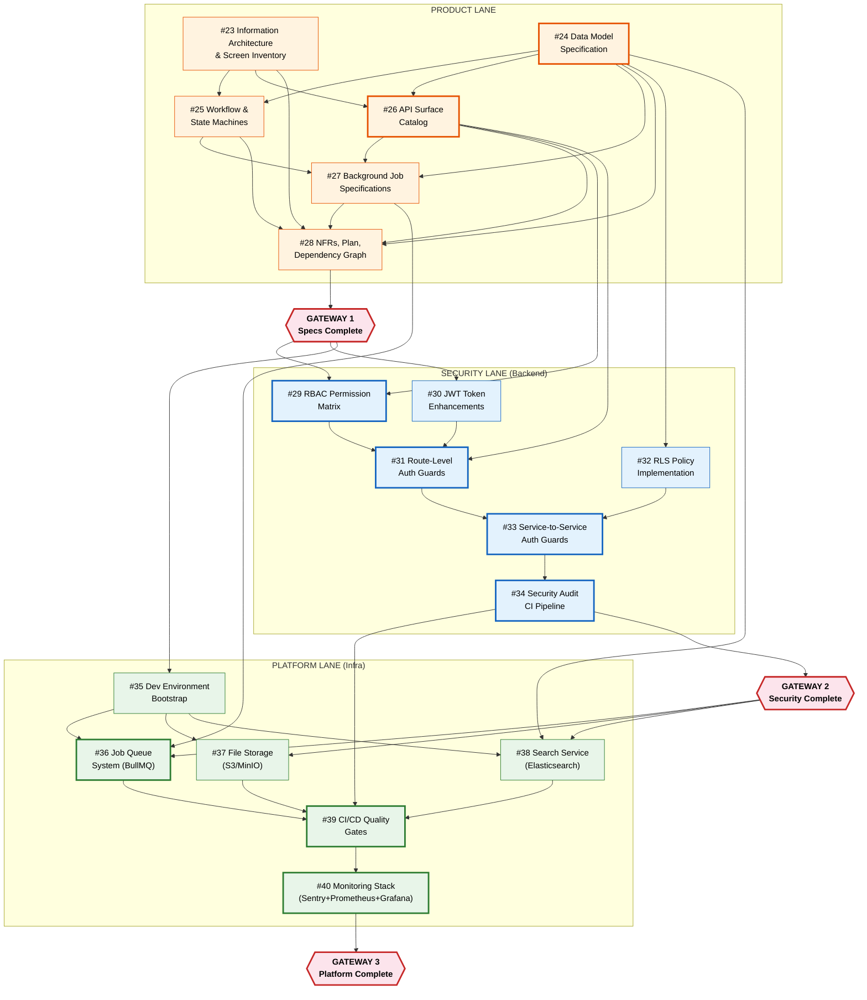

# Task Dependency Graph

> **Document**: Dependency Graph v1.0
> **Status**: Draft
> **Last Updated**: 2026-02-08
> **Owner**: Product Team
> **Related Issues**: #28

---

## Overview

This document maps dependencies between all 18 tasks (#23-#40) across the Arda V2 MVP plan. The graph identifies the critical path, parallel execution opportunities, and gateway milestones where work streams must synchronize.

---

## Dependency Flowchart



---

## Critical Path

The critical path determines the minimum project duration. Any delay on these tasks delays the entire project.

```
#24 Data Model --> #26 API Surface --> GW1 Specs Complete
  --> #29 RBAC Matrix --> #31 Auth Guards --> #33 Service Auth
  --> #34 Security CI --> GW2 Security Complete
  --> #36 Job Queues --> #39 CI/CD Quality Gates
  --> #40 Monitoring --> GW3 Platform Complete
```

**Critical path duration**: 12 weeks (no slack)

| Task | Duration | Earliest Start | Latest Start | Slack |
|---|---|---|---|---|
| #24 Data Model | Week 1 | Week 1 | Week 1 | 0 |
| #26 API Surface | Week 1-2 | Week 1 | Week 1 | 0 |
| #29 RBAC Matrix | Week 3 | Week 3 | Week 3 | 0 |
| #31 Auth Guards | Week 4 | Week 4 | Week 4 | 0 |
| #33 Service Auth | Week 5 | Week 5 | Week 5 | 0 |
| #34 Security CI | Week 5-6 | Week 5 | Week 5 | 0 |
| #36 Job Queues | Week 7 | Week 7 | Week 7 | 0 |
| #39 CI/CD Gates | Week 9 | Week 9 | Week 9 | 0 |
| #40 Monitoring | Week 10 | Week 10 | Week 10 | 0 |

---

## Parallel Execution Opportunities

### Phase 1: Specifications (Weeks 1-2)

All product lane tasks can be parallelized across agents:

```
PARALLEL GROUP A (Week 1):
  #23 Info Architecture  ---|
  #24 Data Model         ---|---> feeds into Week 1-2 tasks
                              |
PARALLEL GROUP B (Week 1-2, after partial A completion):
  #25 Workflows          ---|
  #26 API Surface        ---|---> feeds into #27, #28
                              |
PARALLEL GROUP C (Week 2):
  #27 Background Jobs    ---|
  #28 NFRs + Plan        ---|---> GW1
```

### Phase 2: Security (Weeks 3-4)

```
PARALLEL (Week 3):
  #29 RBAC Permission Matrix    (depends on #26)
  #30 JWT Token Enhancements    (depends on GW1 only)
  #32 RLS Policies              (depends on #24)

SEQUENTIAL (Week 4, after #29 + #30):
  #31 Auth Guards               (depends on #29, #30)
```

### Phase 3: Security Hardening + Platform (Weeks 5-6)

```
PARALLEL (Week 5):
  #33 Service-to-Service Auth   (depends on #31, #32)
  #35 Dev Environment Bootstrap (depends on GW1 only)

SEQUENTIAL (Week 5-6):
  #34 Security Audit CI         (depends on #33)
```

### Phase 4: Platform Infrastructure (Weeks 7-8)

```
PARALLEL (Weeks 7-8, after #35 + GW2):
  #36 Job Queue System          (depends on #35, #27)
  #37 File Storage              (depends on #35)
  #38 Search Service            (depends on #35, #24)
```

### Phase 5: Observability (Weeks 9-10)

```
SEQUENTIAL:
  #39 CI/CD Quality Gates       (depends on #34, #36, #37, #38)
  #40 Monitoring Stack          (depends on #39)
```

---

## Gateway Milestones

### GW1: Specifications Complete (End of Week 2)

**All lanes synchronize here.**

| Prerequisite | Description |
|---|---|
| #23 complete | Information architecture and screen inventory |
| #24 complete | Data model specification |
| #25 complete | Workflow and state machine specs |
| #26 complete | API surface catalog |
| #27 complete | Background job specifications |
| #28 complete | NFRs, 12-week plan, dependency graph, risk register |

**Gate criteria**: All 6 spec documents reviewed and approved. Teams can begin implementation.

### GW2: Security Complete (End of Week 6)

**Security and Platform lanes synchronize here.**

| Prerequisite | Description |
|---|---|
| #29 complete | RBAC permission matrix implemented |
| #30 complete | JWT token enhancements deployed |
| #31 complete | Route-level auth guards on all endpoints |
| #32 complete | RLS policies active on all tenant tables |
| #33 complete | Service-to-service authentication |
| #34 complete | Security audit CI pipeline green |

**Gate criteria**: Security audit CI passes. Cross-tenant isolation verified. All endpoints authenticated. No critical/high security findings.

### GW3: Platform Complete (End of Week 10)

**All lanes synchronize before stabilization.**

| Prerequisite | Description |
|---|---|
| #35 complete | Dev environment bootstrap operational |
| #36 complete | BullMQ job queue with all 6 job types |
| #37 complete | File storage with signed URLs |
| #38 complete | Search service for catalog and orders |
| #39 complete | CI/CD quality gates enforced |
| #40 complete | Monitoring stack operational |

**Gate criteria**: All infrastructure services operational. Monitoring dashboards show green. CI/CD pipeline enforces all quality gates. NFR targets measurable.

---

## Task Summary Table

| # | Task | Lane | Depends On | Blocks | Duration | Weeks |
|---|---|---|---|---|---|---|
| 23 | Info Architecture | Product | - | 25, 26, 28 | 3d | 1 |
| 24 | Data Model | Product | - | 25, 26, 27, 28, 32, 38 | 4d | 1 |
| 25 | Workflows | Product | 23, 24 | 27, 28 | 3d | 1-2 |
| 26 | API Surface | Product | 23, 24 | 27, 28, 29, 31 | 4d | 1-2 |
| 27 | Background Jobs | Product | 24, 25, 26 | 28, 36 | 3d | 2 |
| 28 | NFRs + Plan | Product | 23-27 | GW1 | 3d | 2 |
| 29 | RBAC Matrix | Security | 26, GW1 | 31 | 5d | 3 |
| 30 | JWT Enhancements | Security | GW1 | 31 | 4d | 3 |
| 31 | Auth Guards | Security | 29, 30 | 33 | 5d | 4 |
| 32 | RLS Policies | Security | 24, GW1 | 33 | 5d | 3-4 |
| 33 | Service Auth | Security | 31, 32 | 34 | 4d | 5 |
| 34 | Security CI | Security | 33 | GW2, 39 | 4d | 5-6 |
| 35 | Dev Bootstrap | Platform | GW1 | 36, 37, 38 | 5d | 6 |
| 36 | Job Queues | Platform | 27, 35, GW2 | 39 | 5d | 7 |
| 37 | File Storage | Platform | 35, GW2 | 39 | 5d | 7-8 |
| 38 | Search Service | Platform | 24, 35, GW2 | 39 | 5d | 7-8 |
| 39 | CI/CD Gates | Platform | 34, 36, 37, 38 | 40 | 5d | 9 |
| 40 | Monitoring | Platform | 39 | GW3 | 5d | 10 |

---

## Revision History

| Version | Date | Author | Changes |
|---|---|---|---|
| 1.0 | 2026-02-08 | Product Lane Agent | Initial dependency graph |
