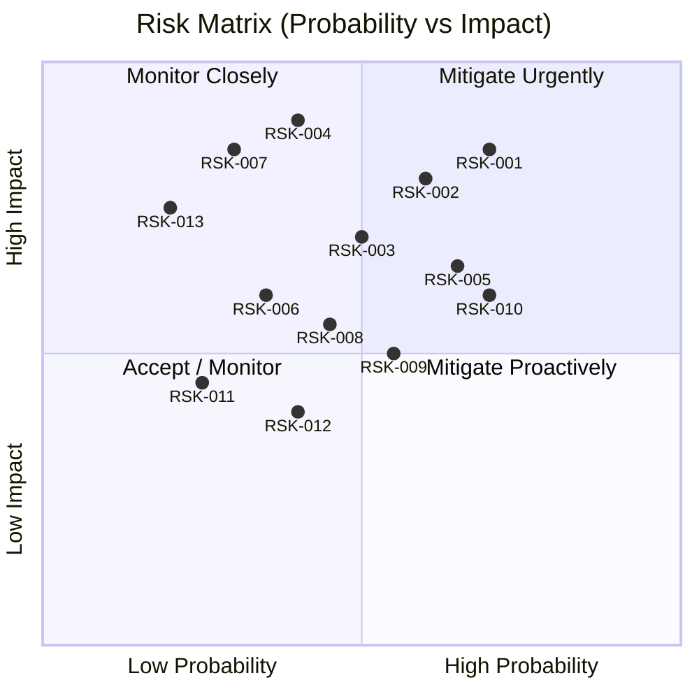

# Risk Register

> **Document**: Risk Register v1.0
> **Status**: Draft
> **Last Updated**: 2026-02-08
> **Owner**: Product Team
> **Related Issues**: #28

---

## Table of Contents

1. [Risk Matrix](#risk-matrix)
2. [Risk Register](#risk-register)
3. [Top 5 Risks — Detailed Analysis](#top-5-risks--detailed-analysis)
4. [Risk Monitoring Schedule](#risk-monitoring-schedule)

---

## Risk Matrix

### Scoring Guide

| Probability | Score | Description |
|---|---|---|
| **High** | 3 | > 60% likelihood of occurring |
| **Medium** | 2 | 30-60% likelihood |
| **Low** | 1 | < 30% likelihood |

| Impact | Score | Description |
|---|---|---|
| **High** | 3 | Delays launch by > 1 week or causes data loss / security breach |
| **Medium** | 2 | Delays features by 3-5 days or degrades user experience |
| **Low** | 1 | Minor inconvenience, workaround available |

| Risk Score | Formula | Action |
|---|---|---|
| 7-9 | P + I >= 5, or P*I = 9 | Mitigate urgently; assign owner immediately |
| 4-6 | P + I = 4, or P*I = 4-6 | Mitigate proactively; track weekly |
| 1-3 | P + I <= 3 | Accept and monitor monthly |

---

## Risk Register

| ID | Risk | Category | Prob | Impact | Score | Mitigation | Contingency | Owner | Status |
|---|---|---|---|---|---|---|---|---|---|
| RSK-001 | **Tenant data leakage via missing RLS policies** | Security | High | High | 9 | Automated query audit in CI (#34); RLS on all tenant tables (#32); integration tests verifying cross-tenant isolation | Immediate incident response; revoke affected tokens; forensic audit of access logs | Data Team | Open |
| RSK-002 | **PostgreSQL connection pool exhaustion under load** | Technical | Medium | High | 8 | Connection pooling with hard limits (max=20 per replica); health check monitors pool usage; circuit breaker on pool exhaustion | Restart affected service replicas; increase pool limits temporarily; add PgBouncer as connection proxy | Data Team | Open |
| RSK-003 | **Redis single point of failure** | Technical | Medium | High | 8 | Graceful degradation when Redis down (NFR-REL-005); in-memory fallbacks for rate limiting and caching; health check includes Redis status | Switch to managed Redis with automatic failover (Railway Redis or AWS ElastiCache); manual restart with data persistence (RDB snapshots) | Platform Team | Open |
| RSK-004 | **Schema migration data loss** | Technical | Low | High | 7 | Drizzle Kit migration safety checks in CI (#39); no destructive migrations without manual approval; always backup before migration | Point-in-time recovery from PostgreSQL WAL; restore from pre-migration backup; manual data reconciliation | Data Team | Open |
| RSK-005 | **Scope creep during 12-week execution** | Schedule | High | Medium | 7 | Strict scope defined in specs (#23-#28); change request process requiring impact analysis; weekly scope review in sprint planning | Defer non-critical scope to post-MVP; extend timeline for critical additions only with stakeholder approval | Product Team | Open |
| RSK-006 | **JWT token refresh race conditions in browser** | Technical | Medium | Medium | 6 | Mutex/queue pattern for refresh requests; only one refresh in-flight at a time; retry logic with jitter; silent refresh before expiry (at 80% TTL) | Force re-login on refresh failure; clear tokens and redirect to login; user sees brief interruption | Backend Team | Open |
| RSK-007 | **Third-party API failures (Stripe, email provider)** | Technical | Low | High | 7 | Circuit breaker pattern for external calls; retry with exponential backoff; queue failed operations for retry; health dashboard shows dependency status | Manual processing of failed transactions; customer communication for payment issues; fallback email provider | Backend Team | Open |
| RSK-008 | **Background job queue backup during high load** | Technical | Medium | Medium | 6 | BullMQ with configurable concurrency; priority queues for critical jobs; dead letter queue for failures; monitoring dashboard (Bull Board) | Scale worker replicas horizontally; increase concurrency limits; clear non-critical jobs from queue; manual execution of critical jobs | Backend Team | Open |
| RSK-009 | **CI/CD pipeline failures blocking deploys** | Schedule | Medium | Medium | 6 | Pipeline stages isolated (lint, test, build, deploy can fail independently); manual override for non-critical failures; flaky test detection and quarantine | Manual deploy via Railway CLI; bypass non-critical CI stages with approval; hotfix branch with minimal CI | Platform Team | Open |
| RSK-010 | **Knowledge concentration (bus factor = 1)** | Organizational | High | Medium | 7 | Code review requirements (2 reviewers); pair programming on critical components; documentation of architecture decisions; cross-training sessions biweekly | Detailed runbooks for all operational procedures; recorded knowledge transfer sessions; contractor backfill for critical roles | All Teams | Open |
| RSK-011 | **Elasticsearch operational complexity exceeds capacity** | Technical | Low | Medium | 4 | Evaluate PostgreSQL full-text search as simpler alternative before committing (#38); start with minimal ES config; use managed Elasticsearch if self-hosted too complex | Replace Elasticsearch with PostgreSQL `tsvector` full-text search; accept reduced search features (no faceted search) | Platform Team | Open |
| RSK-012 | **Frontend performance regression during feature development** | Technical | Medium | Low | 4 | Lighthouse CI in PR checks (#39); bundle size monitoring; React.lazy code splitting; performance budget in CI | Revert offending PR; profile and optimize critical render paths; defer non-critical UI features | Frontend Team | Open |
| RSK-013 | **Data export compliance issues (GDPR, tenant data isolation)** | Compliance | Low | High | 7 | Data export scoped strictly by tenantId; audit logging on all export operations; export job includes tenant verification step; data retention policies documented | Immediate export suspension; audit of all prior exports; tenant notification; legal review | Data Team, Product Team | Open |

---

## Top 5 Risks -- Detailed Analysis

### RSK-001: Tenant Data Leakage via Missing RLS Policies

**Risk Score**: 9 (High Probability, High Impact)

**Description**: With 40+ database tables across 8 schemas and multi-tenant architecture, a single missing `tenantId` WHERE clause could expose one tenant's data to another. This is the highest-severity risk because it directly impacts customer trust and may have legal/compliance consequences.

**Current State**: Tenant isolation is enforced at the application layer (Drizzle ORM queries include `tenantId`). No PostgreSQL Row-Level Security policies are in place yet. This means a single developer oversight in a new query could leak data.

**Root Causes**:
- Manual `tenantId` scoping is error-prone at scale
- New developers may not understand tenant isolation requirements
- Complex queries (joins, subqueries, aggregations) may accidentally omit tenant scope
- Admin/reporting queries may intentionally bypass tenant scope without proper safeguards

**Mitigation Strategy**:
1. **Week 3-4 (#32)**: Implement PostgreSQL RLS policies on ALL tenant-scoped tables as defense-in-depth
2. **Week 3 (#29)**: RBAC matrix explicitly defines which roles can access cross-tenant data (answer: only system admin, and only via dedicated admin queries)
3. **Week 5 (#34)**: Automated CI check that analyzes all Drizzle queries for `tenantId` presence
4. **Ongoing**: Integration test suite with cross-tenant access attempts for every new endpoint

**Contingency Plan**:
1. Immediately revoke all JWT tokens for affected tenants
2. Forensic analysis of audit logs to determine data exposure scope
3. Notify affected tenants within 24 hours (per breach notification requirements)
4. Patch the specific query/endpoint within 4 hours
5. Post-incident review and additional test coverage

**Early Warning Indicators**:
- Audit log shows user accessing resources with mismatched `tenantId`
- Integration test for cross-tenant isolation fails
- Code review identifies query without tenant scope

---

### RSK-002: PostgreSQL Connection Pool Exhaustion Under Load

**Risk Score**: 8 (Medium Probability, High Impact)

**Description**: With 6 microservices each maintaining their own connection pool, and multiple replicas per service, the total connection demand can exceed PostgreSQL's `max_connections` (default: 100). Under load spikes, services compete for connections, leading to query timeouts, 500 errors, and cascading failures.

**Current State**: Each service uses Drizzle ORM with `postgres.js` driver. Connection pool limits are not explicitly configured, meaning each service may use the driver's default (which could be unlimited or too high).

**Root Causes**:
- No explicit pool sizing configuration per service
- 6 services x N replicas = many potential connections
- Long-running queries hold connections, reducing availability
- No connection pooling middleware (e.g., PgBouncer) between services and database

**Mitigation Strategy**:
1. **Week 3**: Configure explicit pool limits per service: `min=2, max=10` (6 services x 2 replicas x max 10 = 120, fits within 150 `max_connections`)
2. **Week 6 (#35)**: Dev environment includes pool monitoring via `pg_stat_activity`
3. **Week 10 (#40)**: Prometheus metrics for connection pool: active, idle, waiting, total
4. **Ongoing**: Query optimization to reduce connection hold time; avoid long-running queries in request path

**Contingency Plan**:
1. Identify service with highest connection usage via `pg_stat_activity`
2. Reduce that service's pool max temporarily
3. Kill idle connections: `SELECT pg_terminate_backend(pid) FROM pg_stat_activity WHERE state = 'idle' AND query_start < now() - interval '5 minutes'`
4. Deploy PgBouncer as connection multiplexer if problem persists
5. Scale PostgreSQL to higher `max_connections` if on managed hosting

**Early Warning Indicators**:
- `pg_stat_activity` shows count approaching `max_connections`
- Connection wait time > 1s in pool metrics
- Sporadic 500 errors with "too many connections" in logs

---

### RSK-003: Redis Single Point of Failure

**Risk Score**: 8 (Medium Probability, High Impact)

**Description**: Redis serves multiple critical functions: WebSocket event pub/sub, rate limiting state, BullMQ job queue persistence, and session caching. A Redis outage affects all of these simultaneously, degrading or disabling real-time features, background processing, and API protection.

**Current State**: Single Redis instance in Docker Compose. No Redis Sentinel or Cluster configuration. No degradation handling implemented.

**Root Causes**:
- Single Redis instance with no replication
- Multiple critical subsystems depend on the same Redis instance
- Redis is in-memory; power loss means data loss for non-persisted data
- No circuit breaker pattern for Redis connections

**Mitigation Strategy**:
1. **Week 5-6 (NFR-REL-005)**: Implement graceful degradation for each Redis consumer:
   - Rate limiting: fall back to in-process token bucket (less accurate but functional)
   - WebSocket pub/sub: buffer events in-memory (bounded, 1000 max) and retry
   - BullMQ: jobs pause and auto-resume on reconnect (built-in behavior)
   - Caching: bypass cache and query database directly (higher latency but functional)
2. **Week 6 (#35)**: Dev environment Redis configured with AOF persistence
3. **Week 10 (#40)**: Redis health check in monitoring; alert on connection failures
4. **Post-MVP**: Migrate to managed Redis with automatic failover (Railway Redis or AWS ElastiCache)

**Contingency Plan**:
1. Restart Redis container (< 30 seconds typically)
2. If data loss: BullMQ jobs re-enqueued from database state; rate limit counters reset (brief window of no rate limiting)
3. If Redis host failure: spin up new Redis instance; update connection strings; restart services
4. Emergency: disable WebSocket features; serve API-only until Redis restored

**Early Warning Indicators**:
- Redis `PING` latency > 100ms
- Redis memory usage > 80% of allocated
- BullMQ queue depth growing unexpectedly (Redis processing slowdown)

---

### RSK-004: Schema Migration Data Loss

**Risk Score**: 7 (Low Probability, High Impact)

**Description**: Database schema migrations (via Drizzle Kit) that alter or drop columns, rename tables, or change data types can cause irreversible data loss if not executed carefully. With 40+ tables and active production data, a bad migration could destroy critical business data.

**Current State**: Drizzle Kit generates SQL migrations. `scripts/migrate.sh` supports generate/migrate/push/status commands. No automated safety checks on migration content.

**Root Causes**:
- Drizzle Kit `push` can be destructive (drops columns to match schema)
- `ALTER TABLE DROP COLUMN` is irreversible without backup
- Rename operations may be interpreted as drop+create by migration tools
- No pre-migration backup automation
- No migration review process beyond code review

**Mitigation Strategy**:
1. **Week 9 (#39)**: CI check that scans migration SQL for destructive operations (`DROP`, `ALTER ... DROP`, `TRUNCATE`, `DELETE`)
2. **Week 9 (#39)**: Destructive migrations require manual approval label on PR (`migration-destructive-approved`)
3. **Ongoing**: Always use `drizzle-kit generate` (not `push`) in production; review generated SQL before applying
4. **Ongoing**: Pre-migration backup script that creates point-in-time snapshot
5. **Post-MVP**: Blue-green migration strategy (apply to replica first, verify, then promote)

**Contingency Plan**:
1. Stop all services immediately to prevent further data corruption
2. Restore from most recent backup (RPO < 5 minutes per NFR-REL-003)
3. Replay WAL logs to point just before migration
4. Verify data integrity with checksums
5. Rewrite migration to be non-destructive (add new column, migrate data, drop old column in separate migration)

---

### RSK-005: Scope Creep During 12-Week Execution

**Risk Score**: 7 (High Probability, Medium Impact)

**Description**: As teams implement features, they discover edge cases, missing requirements, or "nice-to-have" improvements that were not in the original specification. Each small addition seems reasonable in isolation, but collectively they can delay the project by weeks.

**Current State**: Specifications (#23-#28) define MVP scope. However, implementation often reveals gaps that were not anticipated during specification.

**Root Causes**:
- Specs cannot anticipate every implementation detail
- Stakeholders request additions after seeing early demos
- Developers add "while I'm in here" improvements
- Edge cases discovered during testing require additional work
- Competitive pressure to add features not in original plan

**Mitigation Strategy**:
1. **Week 2 (GW1)**: Specs explicitly define what is OUT of scope for each task
2. **Ongoing**: Change request process:
   - Any new requirement filed as GitHub issue with `scope-change` label
   - Impact analysis required: effort, dependencies, risk
   - Product owner approval required before adding to sprint
   - Must identify what gets deferred if new work is added
3. **Weekly**: Scope review in sprint planning — compare planned vs actual velocity
4. **Ongoing**: "Parking lot" document for post-MVP ideas (capture without committing)

**Contingency Plan**:
1. If behind schedule by > 1 week at any gateway milestone:
   - Review all in-progress items; identify what can be deferred to post-MVP
   - Reduce scope of remaining items to minimum viable
   - Extend timeline only for items on critical path
2. If specific feature is causing scope expansion:
   - Ship simplified version (80/20 rule)
   - Document full vision for post-MVP iteration
3. Communicate timeline changes to stakeholders immediately (no surprises)

---

## Risk Monitoring Schedule

| Frequency | Activity | Participants | Output |
|---|---|---|---|
| **Weekly** | Risk review in sprint planning | All team leads | Updated risk statuses, new risks identified |
| **Biweekly** | Top 5 risks deep dive | Project lead, risk owners | Mitigation progress report |
| **Gateway milestones** | Full risk register review | All teams | Updated probabilities and scores based on current state |
| **Monthly** | Risk retrospective | All teams | Lessons learned, closed risks, new risk patterns |

### Risk Status Definitions

| Status | Description |
|---|---|
| **Open** | Risk identified, mitigation planned or in progress |
| **Mitigated** | Mitigation actions completed, risk reduced to acceptable level |
| **Triggered** | Risk has materialized, contingency plan activated |
| **Closed** | Risk no longer applicable (either mitigated or no longer relevant) |

---

## Revision History

| Version | Date | Author | Changes |
|---|---|---|---|
| 1.0 | 2026-02-08 | Product Lane Agent | Initial risk register |
