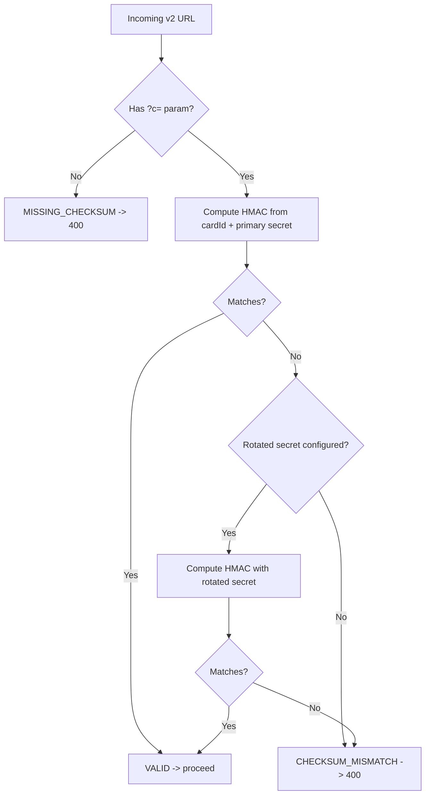

# QR Payload v2 Contract, Compatibility & Error Taxonomy

> **Epic**: MVP-22 — PWA Card Scanning
> **Ticket**: #86 — Define QR payload v2 contract, compatibility, and error taxonomy
> **Status**: Draft
> **Last updated**: 2026-02-10

---

## 1. Payload Format

### 1.1 Version Comparison

| Attribute | v1 (current) | v2 (new) |
|-----------|-------------|----------|
| URL pattern | `/scan/{cardId}` | `/scan/v2/{cardId}?c={checksum}` |
| Checksum | None | HMAC-SHA256 truncated (4 bytes, base62) |
| Max URL length | ~73 chars | ~83 chars |
| QR version at ECC-H | v4 (50 alphanumeric) — tight fit | v5 (84 alphanumeric) — comfortable |
| Backward compatible | -- | Yes (server accepts both) |

### 1.2 URL Structure

```
v1:  https://{tenant}.arda.cards/scan/{uuid}
v2:  https://{tenant}.arda.cards/scan/v2/{uuid}?c={checksum}
dev: {APP_URL}/scan/v2/{uuid}?c={checksum}
```

### 1.3 URL Examples

```
v1: https://acme.arda.cards/scan/a0b1c2d3-e4f5-6789-abcd-ef0123456789
v2: https://acme.arda.cards/scan/v2/a0b1c2d3-e4f5-6789-abcd-ef0123456789?c=7kQ9xZ
```

### 1.4 TypeScript Type

```typescript
export type QrPayloadVersion = 'v1' | 'v2';
```

---

## 2. Checksum Specification

### 2.1 Algorithm

| Property | Value |
|----------|-------|
| Algorithm | HMAC-SHA256 |
| Input | Card UUID (lowercase, with hyphens) |
| Secret | `QR_CHECKSUM_SECRET` environment variable |
| Truncation | First 4 bytes of the HMAC digest |
| Encoding | Base62 (`[0-9A-Za-z]`) |
| Output length | 6 characters (fixed) |

### 2.2 Generation Pseudocode

```typescript
import { createHmac } from 'crypto';

const BASE62 = '0123456789ABCDEFGHIJKLMNOPQRSTUVWXYZabcdefghijklmnopqrstuvwxyz';

function generateChecksum(cardId: string, secret: string): string {
  const hmac = createHmac('sha256', secret)
    .update(cardId.toLowerCase())
    .digest();

  // Truncate to first 4 bytes -> 32-bit integer
  const value = hmac.readUInt32BE(0);

  // Encode as base62 (6 chars, zero-padded)
  let result = '';
  let remaining = value;
  for (let i = 0; i < 6; i++) {
    result = BASE62[remaining % 62] + result;
    remaining = Math.floor(remaining / 62);
  }
  return result;
}
```

### 2.3 Verification Flow



### 2.4 Secret Rotation Procedure

1. Set `QR_CHECKSUM_SECRET_ROTATED` to the **old** secret value.
2. Update `QR_CHECKSUM_SECRET` to the **new** secret value.
3. Deploy. The server now accepts checksums from both secrets.
4. Re-print any cards that need updated QR codes (new cards auto-generate with new secret).
5. After all old-secret cards are reprinted or retired, remove `QR_CHECKSUM_SECRET_ROTATED`.

### 2.5 Security Boundary

> **The checksum is NOT a security mechanism.** With only 32 bits of entropy (~1 in 4 billion collision resistance), it guards against accidental corruption (printing errors, QR degradation) -- not adversarial forgery. Authentication is handled by JWT on the trigger endpoint, not by the QR payload.

### 2.6 Checksum Status Type

```typescript
export type ChecksumStatus = 'valid' | 'skipped' | 'mismatch' | 'missing';
```

- `valid` -- v2 URL, checksum verified against primary or rotated secret.
- `skipped` -- v1 URL, no checksum present (backward compatibility).
- `mismatch` -- v2 URL, checksum present but invalid.
- `missing` -- v2 URL path detected but `?c=` query param absent.

---

## 3. Version Negotiation

### 3.1 Server-Side Detection

Version is determined by URL pattern matching. Express routes are registered most-specific first:

```typescript
// Register v2 BEFORE v1 (Express matches first defined route)
scanRouter.get('/v2/:cardId', handleScanV2);
scanRouter.post('/v2/:cardId/trigger', authMiddleware, handleTriggerV2);

// v1 routes (existing -- unchanged)
scanRouter.get('/:cardId', handleScanV1);
scanRouter.post('/:cardId/trigger', authMiddleware, handleTriggerV1);
```

**Route resolution**:

| Incoming URL | Matched Route | Version |
|---|---|---|
| `/scan/v2/abc-123?c=7kQ9xZ` | `/v2/:cardId` | v2 |
| `/scan/abc-123` | `/:cardId` | v1 |

### 3.2 Client-Side Parsing

The PWA `extractCardId()` function is updated to detect the version segment:

```typescript
interface ParsedQrPayload {
  cardId: string;
  version: QrPayloadVersion;
  checksum?: string;
}

function extractCardId(raw: string): ParsedQrPayload | null {
  // Try raw UUID first (manual entry)
  const UUID_RE = /^[0-9a-f]{8}-[0-9a-f]{4}-[0-9a-f]{4}-[0-9a-f]{4}-[0-9a-f]{12}$/i;
  if (UUID_RE.test(raw.trim())) {
    return { cardId: raw.trim(), version: 'v1' };
  }

  try {
    const url = new URL(raw);
    const segments = url.pathname.split('/').filter(Boolean);

    // /scan/v2/{uuid}?c={checksum}
    const scanIdx = segments.indexOf('scan');
    if (scanIdx >= 0 && segments[scanIdx + 1] === 'v2') {
      const cardId = segments[scanIdx + 2];
      if (cardId && UUID_RE.test(cardId)) {
        return {
          cardId,
          version: 'v2',
          checksum: url.searchParams.get('c') ?? undefined,
        };
      }
    }

    // /scan/{uuid} (v1 fallback)
    if (scanIdx >= 0) {
      const cardId = segments[scanIdx + 1];
      if (cardId && UUID_RE.test(cardId)) {
        return { cardId, version: 'v1' };
      }
    }
  } catch {
    // Not a valid URL -- ignore
  }

  return null;
}
```

---

## 4. Backward Compatibility Matrix

### 4.1 Guarantee

**v1 URLs are permanently supported.** There is no sunset date. The server MUST accept v1 URLs for as long as physical cards with v1 QR codes may exist in the field.

### 4.2 Scanner Version Compatibility

| Scanner Version | v1 QR Code | v2 QR Code |
|----------------|-----------|-----------|
| Current PWA (pre-v2 update) | Works | Fails (cannot parse `/v2/` segment) |
| Updated PWA (v2-aware) | Works (checksum skipped) | Works (checksum verified) |
| Native camera (deep-link) | Redirect works | Redirect works (server handles) |

### 4.3 Migration Path

| Phase | Action | v1 Cards | v2 Cards |
|-------|--------|----------|----------|
| 1 -- Deploy backend | Add `/scan/v2/` routes alongside existing | Served by v1 routes | Served by v2 routes |
| 2 -- Deploy PWA | Update `extractCardId()` to handle both versions | Parsed as v1 | Parsed as v2 |
| 3 -- Update QR generator | `buildScanUrl()` generates v2 URLs for new/reprinted cards | Existing cards unchanged | New cards get v2 URLs |
| 4 -- Gradual reprint | As cards are reprinted (wear, loop changes), they get v2 QR codes | Population shrinks over time | Population grows |

### 4.4 Constraints

- v1 cards MUST continue to work without modification.
- The backend MUST NOT require checksum for v1 URLs.
- The PWA MUST handle both URL formats from the same scanner component.
- Newly generated QR codes SHOULD use v2 format once Phase 3 is deployed.

---

## 5. Error Taxonomy

### 5.1 Error Code Union Type

All scan-related error codes are defined as a single union type in `@arda/shared-types`:

```typescript
export type ScanErrorCode =
  // -- Backend errors (returned by API) --
  | 'CARD_NOT_FOUND'
  | 'CARD_INACTIVE'
  | 'CARD_ALREADY_TRIGGERED'
  | 'TENANT_MISMATCH'
  | 'INVALID_TRANSITION'
  | 'ROLE_NOT_ALLOWED'
  | 'LOOP_TYPE_INCOMPATIBLE'
  | 'METHOD_NOT_ALLOWED'
  | 'LINKED_ORDER_REQUIRED'
  | 'INVALID_ORDER_TYPE'
  | 'MALFORMED_PAYLOAD'
  | 'UNSUPPORTED_VERSION'
  | 'MISSING_CHECKSUM'
  | 'CHECKSUM_MISMATCH'
  | 'RATE_LIMITED'
  | 'INTERNAL_ERROR'
  | 'SERVICE_UNAVAILABLE'
  // -- Client-only errors (never sent by server) --
  | 'CLIENT_CAMERA_DENIED'
  | 'CLIENT_QR_DECODE_FAILED'
  | 'CLIENT_INVALID_UUID'
  | 'CLIENT_NETWORK_OFFLINE'
  | 'CLIENT_TIMEOUT'
  | 'CLIENT_UNKNOWN';
```

### 5.2 Error Metadata Interface

```typescript
export interface ScanErrorMeta {
  code: ScanErrorCode;
  httpStatus: number | null;   // null for client-only errors
  retryable: boolean;
  userMessage: string;
  description: string;
}
```

### 5.3 Error Catalog Type

```typescript
export const SCAN_ERROR_CATALOG: Record<ScanErrorCode, ScanErrorMeta> = { ... };
```

### 5.4 Backend Error Codes

| Code | HTTP | Retryable | User Message | Description |
|------|------|-----------|-------------|-------------|
| `CARD_NOT_FOUND` | 404 | No | "Card not found. This QR code may be invalid." | Card UUID does not exist in the database. |
| `CARD_INACTIVE` | 400 | No | "This card has been deactivated." | `kanban_cards.isActive = false`. |
| `CARD_ALREADY_TRIGGERED` | 400 | No | "This card is already in the '{stage}' stage." | Card is not in `created` stage. |
| `TENANT_MISMATCH` | 403 | No | "This card does not belong to your organization." | JWT `tenantId` does not match card's tenant. |
| `INVALID_TRANSITION` | 400 | No | "This card cannot be transitioned from its current stage." | Generic invalid state machine transition. |
| `ROLE_NOT_ALLOWED` | 403 | No | "Your role does not have permission for this action." | User's role lacks the required permission. |
| `LOOP_TYPE_INCOMPATIBLE` | 400 | No | "This action is not compatible with the loop type." | E.g., trying to create a PO for a production loop. |
| `METHOD_NOT_ALLOWED` | 400 | No | "This transition method is not allowed." | Invalid `method` value for the transition. |
| `LINKED_ORDER_REQUIRED` | 400 | No | "A linked order is required for this transition." | Transition requires an order reference. |
| `INVALID_ORDER_TYPE` | 400 | No | "Invalid order type for this loop." | Order type does not match loop type. |
| `MALFORMED_PAYLOAD` | 400 | No | "Invalid QR code format." | URL does not match any recognized pattern. |
| `UNSUPPORTED_VERSION` | 400 | No | "Unsupported QR code version." | Version segment is present but not `v2`. |
| `MISSING_CHECKSUM` | 400 | No | "QR code integrity check missing." | v2 URL without `?c=` parameter. |
| `CHECKSUM_MISMATCH` | 400 | No | "QR code integrity check failed. Card may need reprinting." | Computed checksum does not match provided value. |
| `RATE_LIMITED` | 429 | Yes | "Too many requests. Please wait a moment." | Per-user or per-IP rate limit exceeded. |
| `INTERNAL_ERROR` | 500 | Yes | "Something went wrong. Please try again." | Unhandled server error. |
| `SERVICE_UNAVAILABLE` | 503 | Yes | "Service temporarily unavailable." | Server is overloaded or in maintenance. |

### 5.5 Client-Only Error Codes

| Code | Retryable | User Message | Description |
|------|-----------|-------------|-------------|
| `CLIENT_CAMERA_DENIED` | No | "Camera access denied. Use manual lookup below." | Browser denied `getUserMedia` permission. |
| `CLIENT_QR_DECODE_FAILED` | No | "Could not read QR code. Try adjusting angle or lighting." | QR decode library failed to extract data. |
| `CLIENT_INVALID_UUID` | No | "Invalid card ID format." | Extracted string is not a valid UUID. |
| `CLIENT_NETWORK_OFFLINE` | Yes | "You are offline. Scan queued and will sync when reconnected." | `navigator.onLine === false` or fetch failed. |
| `CLIENT_TIMEOUT` | Yes | "Request timed out. Please try again." | Fetch exceeded timeout threshold. |
| `CLIENT_UNKNOWN` | Yes | "An unexpected error occurred." | Catch-all for unclassified client errors. |

### 5.6 Retry Classification Summary

**Retryable** (eligible for offline queue replay with exponential backoff):
- `RATE_LIMITED`, `INTERNAL_ERROR`, `SERVICE_UNAVAILABLE`
- `CLIENT_NETWORK_OFFLINE`, `CLIENT_TIMEOUT`, `CLIENT_UNKNOWN`

**Non-retryable** (terminal -- no automatic retry):
- All other codes. The offline queue marks these as `failed` immediately.

### 5.7 Operator-Facing Error States & Recovery UX

Each error code maps to a specific UI treatment and recovery path in the PWA scan view. The UI component types are defined in [`scan-ux.md` Sections 3.1-3.12](./scan-ux.md#3-failure-states).

| Error Code | UI Component | Card Variant | Recovery Actions | Notes |
|---|---|---|---|---|
| `CARD_NOT_FOUND` | Error card | `destructive` | Retry scan; Manual lookup | Scanner stays active |
| `CARD_INACTIVE` | Error card | `destructive` | Contact admin | No retry available |
| `CARD_ALREADY_TRIGGERED` | Warning card | `warning` | Acknowledge (dismiss) | Shows current stage |
| `TENANT_MISMATCH` | Error card | `destructive` | None | No retry available |
| `INVALID_TRANSITION` | Error card | `destructive` | Contact admin | Shows current stage |
| `ROLE_NOT_ALLOWED` | Error card | `destructive` | Contact admin | Suggest role escalation |
| `LOOP_TYPE_INCOMPATIBLE` | Error card | `destructive` | Contact admin | Shows loop type mismatch detail |
| `MALFORMED_PAYLOAD` | Error card | `destructive` | Retry scan; Manual lookup | Scanner stays active |
| `UNSUPPORTED_VERSION` | Error card | `destructive` | Update PWA | Prompt for app update |
| `MISSING_CHECKSUM` | Warning card | `warning` | Proceed (if `warn` mode); Retry | Behavior depends on `QR_CHECKSUM_MODE` |
| `CHECKSUM_MISMATCH` | Error card | `destructive` | Contact admin; Reprint card | No automatic retry |
| `RATE_LIMITED` | Warning card | `warning` | Auto-retry after delay | Shows countdown |
| `INTERNAL_ERROR` | Error card | `destructive` | Retry scan | Retryable |
| `SERVICE_UNAVAILABLE` | Error card | `destructive` | Retry scan | Retryable |
| `CLIENT_CAMERA_DENIED` | Warning banner | `warning` | Manual lookup fallback | Persistent banner |
| `CLIENT_QR_DECODE_FAILED` | Error card | `destructive` | Adjust angle/lighting; Manual lookup | Scanner stays active |
| `CLIENT_INVALID_UUID` | Error card | `destructive` | Re-enter ID | Manual lookup field highlighted |
| `CLIENT_NETWORK_OFFLINE` | Info card | `accent` | Queued automatically | Shows pending badge; sync on reconnect |
| `CLIENT_TIMEOUT` | Error card | `destructive` | Retry scan | Auto-retry eligible |

**Recovery action definitions**:

- **Retry scan**: Scanner viewfinder remains active or is re-activated; operator can re-scan the same or different card.
- **Manual lookup**: The manual UUID entry input is shown/highlighted as an alternative to camera scanning.
- **Acknowledge (dismiss)**: A single "OK" button dismisses the card. No further action needed.
- **Contact admin**: A static message directing the operator to contact their supervisor or admin. Optionally includes an "Escalate" button that logs the issue for supervisor review.
- **Update PWA**: A link or button that triggers the service worker update check (`registration.update()`).
- **Reprint card**: Informational message that the physical card may need reprinting with a corrected QR code.
- **Queued automatically**: No operator action needed. The scan is persisted to IndexedDB and will replay when connectivity returns (see [scan-ux.md Section 4](./scan-ux.md#4-operator-feedback-for-queuedoffline-scans)).

### 5.8 Offline Queue Integration

The existing `NON_RETRYABLE_CODES` set in `apps/web/src/lib/offline-queue.ts` is extended:

```typescript
const NON_RETRYABLE_CODES = new Set([
  // Existing
  'CARD_NOT_FOUND',
  'CARD_INACTIVE',
  'CARD_ALREADY_TRIGGERED',
  'TENANT_MISMATCH',
  'INVALID_TRANSITION',
  'ROLE_NOT_ALLOWED',
  'LOOP_TYPE_INCOMPATIBLE',
  'METHOD_NOT_ALLOWED',
  // New v2 codes
  'MALFORMED_PAYLOAD',
  'UNSUPPORTED_VERSION',
  'MISSING_CHECKSUM',
  'CHECKSUM_MISMATCH',
  'LINKED_ORDER_REQUIRED',
  'INVALID_ORDER_TYPE',
]);
```

---

## 6. Transition Metadata Schema

### 6.1 Response Shape

```typescript
export interface ScanTransitionMetadata {
  cardId: string;
  qrVersion: QrPayloadVersion;
  checksumStatus: ChecksumStatus;
  previousStage: string;
  currentStage: string;
  transitionedAt: string;       // ISO 8601
  idempotentReplay: boolean;
  loopType: string;
  orderId?: string;             // Present when card has a linked order
}
```

### 6.2 Idempotent Replay Behavior

When the backend detects a duplicate `idempotencyKey`:

- HTTP status: **200** (not 400)
- `idempotentReplay: true` is set in the response metadata
- The original transition result is returned unchanged
- No new `card_stage_transitions` row is created
- No new event is emitted

This is consistent with the existing implementation in `card-lifecycle.service.ts` where idempotent replays silently return the original result.

---

## 7. API Contract Changes

### 7.1 New Routes

| Route | Method | Auth | Purpose |
|-------|--------|------|---------|
| `GET /api/kanban/scan/v2/:cardId` | GET | None (public) | v2 deep-link entry. Validates checksum, then redirects or returns JSON. |
| `POST /api/kanban/scan/v2/:cardId/trigger` | POST | JWT | v2 trigger. Validates checksum before executing transition. |

### 7.2 v2 GET Response (JSON mode)

```json
{
  "cardId": "a0b1c2d3-e4f5-6789-abcd-ef0123456789",
  "qrVersion": "v2",
  "checksumStatus": "valid",
  "action": "trigger",
  "redirectUrl": "https://app.arda.io/scan/v2/a0b1c2d3-e4f5-6789-abcd-ef0123456789?c=7kQ9xZ"
}
```

### 7.3 v2 Trigger Success Response

```json
{
  "success": true,
  "card": { "id": "...", "currentStage": "triggered" },
  "loopType": "procurement",
  "partId": "part-uuid",
  "message": "Card triggered. Part added to Order Queue.",
  "metadata": {
    "cardId": "...",
    "qrVersion": "v2",
    "checksumStatus": "valid",
    "previousStage": "created",
    "currentStage": "triggered",
    "transitionedAt": "2026-02-10T12:00:00.000Z",
    "idempotentReplay": false,
    "loopType": "procurement"
  }
}
```

### 7.4 Error Response Shape

```json
{
  "success": false,
  "error": {
    "code": "CHECKSUM_MISMATCH",
    "message": "QR code integrity check failed. Card may need reprinting.",
    "retryable": false
  }
}
```

### 7.5 Environment Variables

| Variable | Required | Description |
|----------|----------|-------------|
| `QR_CHECKSUM_SECRET` | Yes (v2) | HMAC secret for checksum generation and verification. Min 32 characters. |
| `QR_CHECKSUM_SECRET_ROTATED` | No | Previous secret value during rotation window. |

### 7.6 QR URL Generation Update

```typescript
interface BuildScanUrlOptions {
  cardId: string;
  tenantSlug?: string;
  version?: QrPayloadVersion;   // default: 'v2' after Phase 3
  checksumSecret?: string;       // required when version = 'v2'
}
```

---

## Appendix A: QR Code Capacity Validation

| QR Version | ECC Level | Alphanumeric Capacity | Fits v1? (~73 chars) | Fits v2? (~83 chars) |
|------------|-----------|----------------------|--------|--------|
| v4 | H | 78 | Yes (tight) | No |
| v5 | H | 106 | Yes | Yes |
| v5 | M | 134 | Yes | Yes |

The v2 URL (approximately 83 characters) comfortably fits within QR version 5 at ECC-H (106 alphanumeric characters), which is the level used for printed cards subject to physical wear (`generateQRBuffer()` in `qr-generator.ts`).

---

## Appendix B: Related Specifications

- [Scan UX, Deep-Link Contract, and Offline Interaction States](./scan-ux.md) -- PWA scanning flow and failure states
- [Card / Label Printing Layout Specifications](../printing/layout-specs.md) -- QR code size, ECC levels, and URL display
- [Exception Handling](../workflows/exceptions.md) -- Duplicate scan handling, deactivated card behavior, QR checksum mode configuration
- [Lifecycle Transition Matrix](../workflows/lifecycle-transition-matrix.md) -- Valid card stage transitions and guard conditions (T1 = scan-triggered)
