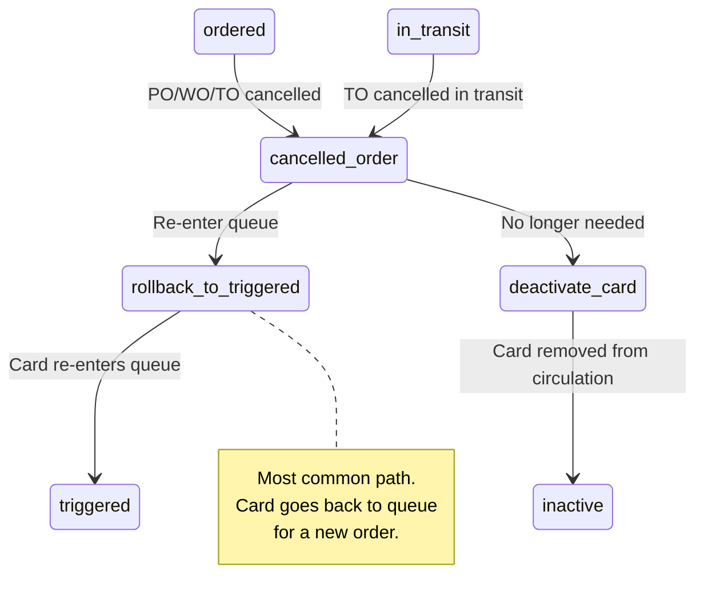

# Exception Handling — Fallback Paths, Error Recovery, and Edge Cases

> Authoritative specification for Arda V2 exception handling in the Kanban workflow.
> Every exception scenario includes a deterministic recovery path.

---

## 1. Card Exception Scenarios

### 1.1 Card Stuck in Stage Too Long

**Definition**: A card remains in a non-terminal stage beyond the expected duration.

#### Detection Thresholds

| Stage | Expected Duration | Alert Threshold | Escalation Threshold |
|-------|-------------------|-----------------|---------------------|
| `triggered` | 0 - 24h (depends on workflow) | Dynamic (see risk scan) | `ageHighThreshold` (lead time + safety stock in hours) |
| `ordered` | Lead time (days) | `statedLeadTimeDays * 1.5 * 24` hours | `statedLeadTimeDays * 2 * 24` hours |
| `in_transit` | Transit time (days) | `statedLeadTimeDays * 24` hours | `statedLeadTimeDays * 1.5 * 24` hours |
| `received` | 0 - 8h (put-away time) | 24 hours | 48 hours |
| `restocked` | 0 - 1h (cycle reset) | 4 hours | 24 hours |

#### Detection Mechanism

1. **Queue risk scan** (for `triggered` stage): The `runQueueRiskScanForTenant()` function identifies cards with elevated triggered age. Runs on a configurable schedule (default: every 15 minutes).
2. **Periodic stage audit** (for other stages): A scheduled job queries all active cards and flags those exceeding alert thresholds.

#### Recovery Procedures

| Stage Stuck In | Recovery Action |
|----------------|-----------------|
| `triggered` | **Action**: Process the card. Create the appropriate order (PO/WO/TO) from the queue.<br>**If card should NOT be processed**: Deactivate the card (`isActive = false`) and document the reason. |
| `ordered` | **Action**: Check the linked order status. If the order is cancelled or stuck, see Section 1.2.<br>**Escalation**: Contact supplier (PO), check production schedule (WO), or check source facility (TO). |
| `in_transit` | **Action**: Check shipment tracking. If no tracking available and past escalation threshold, see Section 2.3.<br>**Escalation**: Contact carrier or source facility. |
| `received` | **Action**: Prompt warehouse team to complete put-away. Manually transition to `restocked`.<br>**Auto-recovery**: If received for > 48h, system can auto-transition to `restocked` with `method = 'system'` and a note explaining the auto-advance. |
| `restocked` | **Action**: Trigger cycle reset. Transition to `created` with `method = 'system'`.<br>**Auto-recovery**: If restocked for > 4h, system auto-resets the cycle. |

---

### 1.2 Order Cancelled Mid-Cycle

**Definition**: The linked order (PO/WO/TO) is cancelled while the card is in `ordered` or `in_transit` stage.



#### Business Rules

| Scenario | Card Current Stage | Recovery Action |
|----------|-------------------|-----------------|
| PO cancelled | `ordered` | Rollback card to `triggered`. Clear `linkedPurchaseOrderId`. Card re-enters procurement queue. |
| PO cancelled | `in_transit` | If goods not yet shipped: rollback to `triggered`. If goods were shipped and returned: rollback to `triggered`. If goods arrive despite cancellation: advance to `received` (handle as exception receipt). |
| WO cancelled | `ordered` | Rollback card to `triggered`. Clear `linkedWorkOrderId`. Card re-enters production queue. |
| WO cancelled (partial production) | `ordered` | If `quantityProduced > 0`: advance card to `received` for partial quantity. Create new card/trigger for remaining quantity. |
| TO cancelled | `ordered` | Rollback card to `triggered`. Clear `linkedTransferOrderId`. Card re-enters transfer queue. |
| TO cancelled | `in_transit` | If goods not shipped: rollback to `triggered`. If shipped: wait for return or receipt. |

#### Rollback Implementation

```typescript
// Exception transition: ordered -> triggered (rollback)
// This is NOT in the standard VALID_TRANSITIONS map.
// It requires a dedicated rollback function with audit trail.

async function rollbackCardToTriggered(input: {
  cardId: string;
  tenantId: string;
  reason: string;
  cancelledOrderId: string;
  cancelledOrderType: 'purchase_order' | 'work_order' | 'transfer_order';
  userId: string;
}): Promise<void> {
  await db.transaction(async (tx) => {
    // 1. Verify card is in 'ordered' or 'in_transit'
    // 2. Update card: currentStage = 'triggered', clear linked order IDs
    // 3. Insert card_stage_transitions with method = 'system',
    //    notes = `Rollback: ${orderType} ${orderId} cancelled. Reason: ${reason}`
    // 4. Insert audit log entry
  });
  // 5. Publish card.transition event (toStage: 'triggered')
  // 6. Card re-appears in the order queue
}
```

**IMPORTANT**: The rollback transition (`ordered` -> `triggered` or `in_transit` -> `triggered`) is an exception path. It is NOT included in the standard `VALID_TRANSITIONS` map. It must be handled by a dedicated function that:
1. Bypasses normal transition validation.
2. Records the exception reason in the transition's `notes` and `metadata`.
3. Logs an audit entry with the cancelled order reference.

---

### 1.3 Partial Receipt (Split Card Behavior)

**Definition**: A PO or TO is partially received. The card's linked order line has `quantityReceived < quantityOrdered`.

#### Behavior Rules

| Condition | Card Behavior |
|-----------|---------------|
| PO line: `quantityReceived = 0` | Card stays in `ordered` or `in_transit`. No transition. |
| PO line: `0 < quantityReceived < quantityOrdered` | Card transitions to `received`. A new trigger may be generated for the shortage (see below). |
| PO line: `quantityReceived >= quantityOrdered` | Card transitions to `received` normally. |
| TO line: Same rules as PO line | Identical behavior. |

#### Shortage Handling

When a partial receipt occurs:

1. The card associated with the partially-received line transitions to `received` (the physical material IS at the facility).
2. The PO status changes to `partially_received`.
3. **Option A (Default)**: The remaining quantity stays on the PO. The supplier is expected to ship the balance. No new card trigger.
4. **Option B (Configurable)**: If the shortage exceeds a configurable threshold (e.g., > 20% short), the system creates a new trigger for the loop, effectively generating a supplemental replenishment signal. This requires:
   - The original card to continue its cycle (received -> restocked -> created).
   - A second card (if multi-card mode) or a system-generated demand event to enter the queue.

#### Implementation Note

Partial receipt tracking happens at the **order line level**, not the card level. The card transitions based on whether its linked line has received any material. The PO/TO tracks the aggregate receipt status across all lines.

---

### 1.4 Duplicate QR Scan Handling

**Definition**: A QR code is scanned when the card is not in the `created` stage.

#### Scenarios and Responses

| Card Current Stage | Scan Result | HTTP Code | Error Code |
|-------------------|-------------|-----------|------------|
| `created` | SUCCESS: Card transitions to `triggered` | 200 | -- |
| `triggered` | REJECTED: Card already triggered | 400 | `CARD_ALREADY_TRIGGERED` |
| `ordered` | REJECTED: Card already in cycle | 400 | `CARD_ALREADY_TRIGGERED` |
| `in_transit` | REJECTED: Card already in cycle | 400 | `CARD_ALREADY_TRIGGERED` |
| `received` | REJECTED: Card already in cycle | 400 | `CARD_ALREADY_TRIGGERED` |
| `restocked` | REJECTED: Card about to reset | 400 | `CARD_ALREADY_TRIGGERED` |

#### User-Facing Message

```
"This card is already in the '{currentStage}' stage.
It can only be scanned when in the 'created' stage."
```

#### Idempotency Rule

Duplicate scans are **not** idempotent. Each scan attempt that fails returns an error. The system does NOT silently accept duplicate scans. Rationale: A duplicate scan may indicate a process error (wrong card scanned) or a physical card handling issue that should be surfaced to the operator.

---

### 1.5 Deactivated Loop / Card Handling

#### Deactivated Card (`kanban_cards.isActive = false`)

| Action | Behavior |
|--------|----------|
| QR Scan | Rejected: `400 CARD_INACTIVE` — "This card has been deactivated." |
| Manual transition | Rejected: `400 CARD_INACTIVE` — "Card is deactivated." |
| System transition | Rejected: Exception logged. No transition occurs. |
| Queue visibility | Card is excluded from queue queries (`isActive = true` filter). |
| Existing cycle | If card was mid-cycle when deactivated, it remains in its current stage but cannot progress. The linked order (if any) is not automatically cancelled. |

#### Deactivated Loop (`kanban_loops.isActive = false`)

| Action | Behavior |
|--------|----------|
| Card trigger (scan) | Card can still be scanned IF `card.isActive = true`. The card transitions to `triggered` but the queue filters out cards from inactive loops. |
| Queue visibility | Cards from inactive loops are excluded from queue queries (`loop.isActive = true` filter). |
| Order creation | Prevented: queue does not show these cards, so orders cannot be created from them. |
| Cycle restart | Prevented: the `restocked` -> `created` transition checks `loop.isActive = true`. If loop is deactivated, the card stays in `restocked` indefinitely. |
| ReLoWiSa | No recommendations generated for inactive loops. |

#### Recovery from Deactivation

1. **Reactivate loop**: Set `kanban_loops.isActive = true`. All cards resume normal behavior.
2. **Reactivate card**: Set `kanban_cards.isActive = true`. Card resumes from its current stage.
3. **Stuck cards after reactivation**: If a card is in `restocked` and the loop was deactivated, reactivating the loop allows the cycle reset to proceed.

---

## 2. Order Exception Scenarios

### 2.1 PO Line Over-Receipt

**Definition**: `quantityReceived > quantityOrdered` for a PO line.

#### Business Rules

| Condition | Action |
|-----------|--------|
| Over-receipt <= 10% of `quantityOrdered` | Accepted by default. System allows the receipt. `quantityReceived` updated. Card transitions normally. |
| Over-receipt > 10% of `quantityOrdered` | Warning generated. Receipt still allowed but flagged. Audit log entry created with `action = 'po_line.over_receipt_warning'`. |
| Any over-receipt | PO line's `quantityReceived` is updated to the actual count. The PO total may need recalculation. |

#### Card Impact

Over-receipt does NOT affect the card's stage transition. The card transitions to `received` regardless of whether the receipt is over, under, or exact. The over-receipt is tracked at the order line level for financial and inventory reconciliation.

---

### 2.2 WO Quantity Rejected Exceeds Threshold

**Definition**: `quantityRejected / quantityToProduce > rejectionThreshold` (default: 10%).

#### Business Rules

| Condition | Action |
|-----------|--------|
| `quantityRejected / quantityToProduce <= 0.10` | Normal. WO continues. |
| `quantityRejected / quantityToProduce > 0.10` and `quantityProduced >= quantityToProduce` | Warning. WO can complete. Card transitions to `received`. Audit entry for high rejection rate. |
| `quantityRejected / quantityToProduce > 0.10` and `quantityProduced < quantityToProduce` | WO placed `on_hold`. Notification sent to production manager. Card stays in `ordered` until WO resumes or is cancelled. |
| WO cancelled due to excessive rejections | Card rollback to `triggered` (see Section 1.2). New WO may be created from the queue. |

#### Notification

When rejection threshold is exceeded, an `order.status_changed` event is emitted with `toStatus = 'on_hold'`, which triggers an `exception_alert` notification via the event listener.

---

### 2.3 TO Shipped But Never Received (Timeout)

**Definition**: A TO has been in `shipped` or `in_transit` status for longer than expected and no receipt has been recorded at the destination.

#### Timeout Thresholds

| Threshold | Duration | Action |
|-----------|----------|--------|
| **Warning** | `statedLeadTimeDays * 1.5` days after `shippedDate` | Notification to tenant_admin. Card remains in `in_transit`. |
| **Escalation** | `statedLeadTimeDays * 2.5` days after `shippedDate` | High-priority notification. System flags the TO as at-risk. |
| **Auto-exception** | `statedLeadTimeDays * 4` days after `shippedDate` | System marks TO as requiring manual intervention. Option to: (a) confirm receipt, (b) cancel TO and rollback card to `triggered`, or (c) file a loss claim. |

#### Recovery Procedures

| Resolution | Steps |
|------------|-------|
| **Goods found and received** | Record receipt on TO lines. Transition card from `in_transit` to `received`. Close TO normally. |
| **Goods lost** | Cancel TO. Rollback card to `triggered` (Section 1.2). Card re-enters transfer queue. Optionally, file an internal loss record. |
| **Goods returned to source** | Cancel TO. Rollback card to `triggered`. Source facility re-shelves material. |

---

## 3. System Exception Scenarios

### 3.1 Redis Pub/Sub Failure (Event Delivery)

**Definition**: The Redis event bus is unavailable or a published event fails to deliver.

#### Architecture Context

The event bus (`@arda/events`) uses Redis pub/sub for real-time event broadcasting. Events are fire-and-forget: the publishing service does NOT wait for consumer acknowledgment.

#### Failure Modes

| Failure | Impact | Mitigation |
|---------|--------|------------|
| Redis connection down | Events not published. Card transitions still succeed (DB is source of truth). | Catch block logs error, does not fail the transition. |
| Subscriber disconnected | Events published but not received by notifications service or WebSocket gateway. | Subscribers reconnect automatically. Missed events are not replayed. |
| Event malformed | Consumer fails to parse. Logged as error. | Schema validation at publish time. |

#### Current Implementation (from `card-lifecycle.service.ts`)

```typescript
// Event publish is outside the DB transaction, wrapped in try/catch
try {
  const eventBus = getEventBus(config.REDIS_URL);
  await eventBus.publish({ ... });
} catch {
  // Non-critical: don't fail the transition if event publishing fails
  console.error(`[card-lifecycle] Failed to publish card.transition event`);
}
```

#### Delivery Guarantee Level

**At-most-once**: Events may be lost but are never duplicated. This is acceptable because:
1. The database is the source of truth for all state.
2. Events are for real-time UI updates and notifications, not for state management.
3. The WebSocket frontend polls as a fallback (every 30 seconds).

#### Recovery: Missed Notification Handling

If a notification is not created due to event failure:
1. The periodic queue risk scan will detect stuck cards and re-emit `queue.risk_detected` events.
2. Users can view the current state via direct API queries (queue list, card detail).
3. No automated replay mechanism exists. If critical, an admin can manually trigger a risk scan via `GET /orders/queue/risk-scan?emitEvents=true`.

---

### 3.2 Concurrent Card Transition (Race Condition)

**Definition**: Two users (or a user and the system) attempt to transition the same card simultaneously.

#### Scenario Examples

| Scenario | Risk |
|----------|------|
| Two operators scan the same QR code within milliseconds | Double trigger attempt |
| User creates PO from queue while another user is creating PO with same card | Double order creation |
| System auto-resets cycle while user manually transitions | Stage conflict |

#### Protection Mechanism: Optimistic Locking

The current implementation uses a **read-then-write** pattern within a database transaction:

```typescript
// 1. Read current card state (within transaction)
const card = await db.query.kanbanCards.findFirst({
  where: and(eq(kanbanCards.id, cardId), eq(kanbanCards.tenantId, tenantId)),
});

// 2. Validate current stage allows transition
if (!isValidTransition(card.currentStage, toStage)) {
  throw new AppError(400, 'Invalid transition');
}

// 3. Update card (within same transaction)
await tx.update(kanbanCards).set({ currentStage: toStage, ... });
```

#### Recommended Enhancement: Row-Level Locking

For production deployments with high concurrency, add `SELECT ... FOR UPDATE` to prevent race conditions:

```typescript
// Within transaction:
const [card] = await tx
  .select()
  .from(kanbanCards)
  .where(eq(kanbanCards.id, cardId))
  .for('update')  // Row-level lock
  .execute();
```

This ensures that if two transitions target the same card, the second one will block until the first commits, then fail validation because the stage has already changed.

#### Outcome of Concurrent Attempts

| Attempt | Result |
|---------|--------|
| First to commit | Succeeds. Card transitions. |
| Second to commit | Fails with `400 INVALID_TRANSITION` because the card is no longer in the expected stage. |

#### Frontend Handling

The frontend should handle `400 INVALID_TRANSITION` gracefully:
1. Refresh the card's current state from the API.
2. Update the local UI to reflect the new stage.
3. Show a toast: "This card was already processed by another user."

---

### 3.3 Stale Queue Data

**Definition**: The queue view in the UI shows cards that have already been processed (ordered) by another user or by auto-consolidation.

#### Detection

Stale data is detected at order creation time:

```typescript
// In create-po handler:
if (cards.some((c) => c.currentStage !== 'triggered')) {
  throw new AppError(400, 'All cards must be in triggered stage');
}
```

#### Prevention Strategy

| Layer | Mechanism |
|-------|-----------|
| **WebSocket** (primary) | `card.transition` events push updates to all connected clients. When a card transitions from `triggered` to `ordered`, the queue view removes it instantly. |
| **Polling** (fallback) | Every 30 seconds, the frontend refetches the queue list. |
| **Optimistic UI** | When a user clicks "Create PO", immediately remove the selected cards from the local queue view (optimistic update). If the API returns an error, re-fetch and restore. |
| **Server-side validation** | All card stage checks happen within the transaction. Stale data causes a clean rejection with a descriptive error message. |

#### Transaction Atomicity

All queue-to-order operations are fully atomic:

- If 5 cards are selected for a PO and card #3 has already been ordered by another user:
  - The **entire** transaction rolls back.
  - **No** PO is created.
  - **No** cards are transitioned.
  - The error message identifies which card(s) failed validation.

---

### 3.4 Database Transaction Failure

**Definition**: The database transaction fails during order creation or card transition.

#### Failure Modes

| Failure | Cause | Recovery |
|---------|-------|----------|
| Deadlock | Two transactions lock rows in conflicting order | PostgreSQL auto-detects and kills one transaction. Retry the operation. |
| Connection lost | Network issue between service and PostgreSQL | Transaction auto-rolls back. Retry the operation. |
| Constraint violation | Unique index conflict (e.g., duplicate PO number) | Regenerate PO number and retry. |
| Timeout | Long-running transaction exceeds `statement_timeout` | Retry with fewer cards (smaller batch). |

#### Retry Policy

| Operation | Max Retries | Backoff | Notes |
|-----------|-------------|---------|-------|
| Card transition | 2 | 100ms, 500ms | Quick retry for transient failures |
| Order creation (single card) | 2 | 200ms, 1s | |
| Order creation (batch) | 1 | 500ms | Reduce batch size on retry |
| Risk scan | 0 | -- | Will run again on next schedule |

---

## 4. Recovery Procedures Summary

### 4.1 Quick Reference: Exception -> Recovery Path

| # | Exception | Detection | Recovery | Automated? |
|---|-----------|-----------|----------|------------|
| 1 | Card stuck in `triggered` | Risk scan | Create order from queue | Manual (user action) |
| 2 | Card stuck in `ordered` | Stage audit | Check linked order; escalate or rollback | Manual (with system alert) |
| 3 | Card stuck in `in_transit` | Stage audit | Check shipment; rollback if lost | Manual (with timeout alert) |
| 4 | Card stuck in `received` | Stage audit | Prompt put-away; auto-advance after 48h | Semi-automated |
| 5 | Card stuck in `restocked` | Stage audit | Auto-reset cycle after 4h | Automated |
| 6 | Order cancelled (card in `ordered`) | Order status change event | Rollback card to `triggered` | Automated (event-driven) |
| 7 | Order cancelled (card in `in_transit`) | Order status change event | Wait for goods resolution, then rollback or advance | Manual (guided by system) |
| 8 | Partial receipt | PO/TO line receipt update | Card advances; shortage tracked at order level | Automated card transition |
| 9 | Duplicate QR scan | Immediate (scan endpoint) | Return error; no state change | Automated (rejection) |
| 10 | Deactivated card | Immediate (transition attempt) | Return error; card frozen in place | Automated (rejection) |
| 11 | Deactivated loop | Queue filter | Cards hidden from queue; cycle reset blocked | Automated (filtering) |
| 12 | PO over-receipt | Receipt recording | Accept with warning; audit log | Semi-automated |
| 13 | WO high rejection | Rejection count check | WO on_hold; notification sent | Semi-automated |
| 14 | TO shipment timeout | Scheduled check | Escalating notifications; manual resolution | Automated alerts |
| 15 | Redis failure | Event publish catch block | Log error; DB state is source of truth | Automated (graceful degradation) |
| 16 | Concurrent transition | DB transaction validation | Second attempt fails cleanly; UI refreshes | Automated (rejection) |
| 17 | Stale queue data | Order creation validation | Transaction rolls back; UI refreshes | Automated (rejection) |

### 4.2 Exception Transition Map

These transitions are OUTSIDE the standard `VALID_TRANSITIONS` map and require dedicated exception-handling functions:

| Exception Transition | When Used | Function |
|---------------------|-----------|----------|
| `ordered` -> `triggered` | Order cancelled, card needs re-queueing | `rollbackCardToTriggered()` |
| `in_transit` -> `triggered` | Shipment lost or returned, card needs re-queueing | `rollbackCardToTriggered()` |
| `received` -> `restocked` (auto) | Card stuck in received > 48h | `autoAdvanceStuckCards()` |
| `restocked` -> `created` (auto) | Card stuck in restocked > 4h | `autoResetStuckCycles()` |

All exception transitions:
1. Use `method = 'system'` in the transition record.
2. Include the exception reason in `notes`.
3. Include exception metadata in `metadata` JSONB field.
4. Emit a `card.transition` event for real-time UI update.
5. Create an audit log entry.

### 4.3 Monitoring and Alerting

| Metric | Alert Condition | Channel |
|--------|----------------|---------|
| Cards in `triggered` > 24h | `queue.risk_detected` event | In-app notification |
| Cards in `ordered` > 2x lead time | Stage audit alarm | In-app notification + email (if configured) |
| Cards in `in_transit` > 2.5x lead time | TO timeout warning | In-app notification |
| WO rejection rate > 10% | WO on_hold event | `exception_alert` notification |
| Redis event publish failures > 5/min | Error log spike | Ops monitoring (external) |
| Transaction rollback rate > 1% | DB metrics | Ops monitoring (external) |
