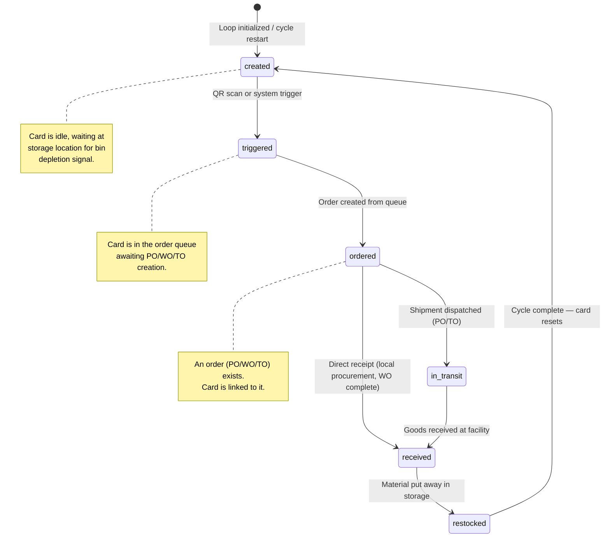
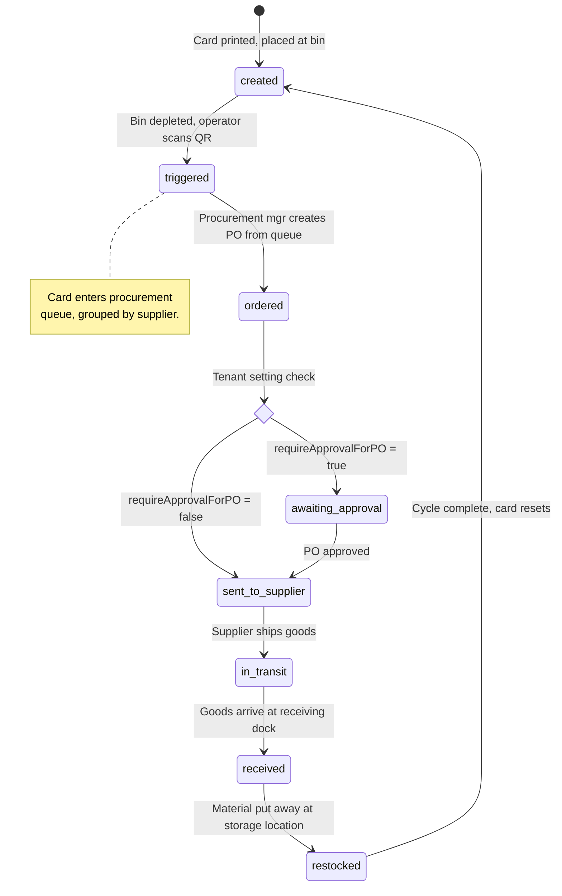
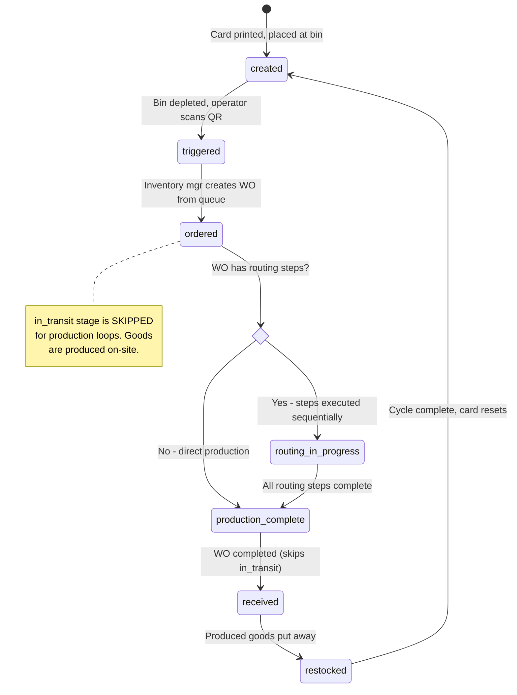
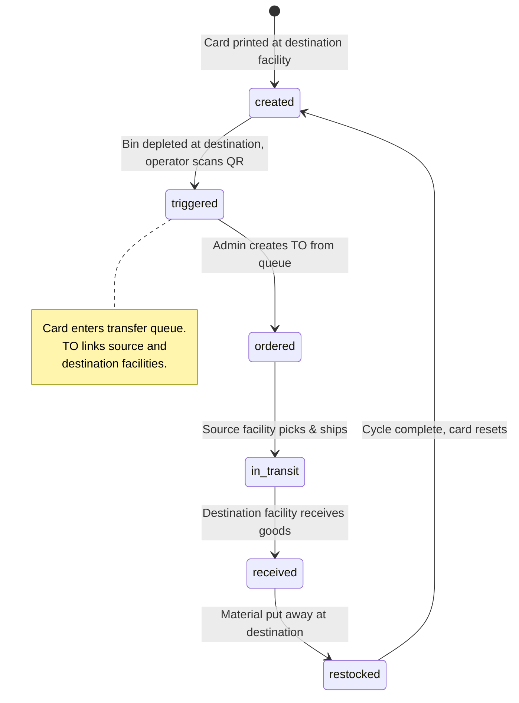

# Kanban Loop Rules — Stage Transitions, Actors, and Validation

> Authoritative specification for Arda V2 Kanban card state machine.
> Source of truth for all service-layer transition logic.

---

## 1. Card Stage State Machine



### 1.1 Stage Enum

```typescript
type CardStage = 'created' | 'triggered' | 'ordered' | 'in_transit' | 'received' | 'restocked';
```

### 1.2 Transition Methods

| Method     | Code        | Description                                           |
|------------|-------------|-------------------------------------------------------|
| QR Scan    | `qr_scan`   | User scans the physical card's QR code                |
| Manual     | `manual`    | User clicks a transition button in the UI             |
| System     | `system`    | Automated transition (order creation, event handler)  |

---

## 2. Complete Stage Transition Matrix

Each cell defines whether the transition is allowed and under what conditions.

### 2.1 Master Matrix

| From \ To     | `created`     | `triggered`   | `ordered`     | `in_transit`  | `received`    | `restocked`   |
|---------------|:-------------:|:-------------:|:-------------:|:-------------:|:-------------:|:-------------:|
| **created**   | --            | ALLOWED       | --            | --            | --            | --            |
| **triggered** | --            | --            | ALLOWED       | --            | --            | --            |
| **ordered**   | --            | --            | --            | ALLOWED       | ALLOWED       | --            |
| **in_transit**| --            | --            | --            | --            | ALLOWED       | --            |
| **received**  | --            | --            | --            | --            | --            | ALLOWED       |
| **restocked** | ALLOWED       | --            | --            | --            | --            | --            |

`--` = Transition is NOT allowed. Any attempt returns HTTP 400 `INVALID_TRANSITION`.

### 2.2 Detailed Transition Rules

#### T1: `created` --> `triggered`

| Attribute          | Value |
|--------------------|-------|
| **Allowed**        | Yes |
| **Loop types**     | All (procurement, production, transfer) |
| **Allowed roles**  | `tenant_admin`, `inventory_manager`, `procurement_manager`, `receiving_manager` |
| **Methods**        | `qr_scan` (primary), `manual`, `system` |
| **Pre-conditions** | 1. Card `isActive = true`<br>2. Card's parent loop `isActive = true`<br>3. Card is currently in `created` stage |
| **Validations**    | 1. Card exists and belongs to requesting tenant<br>2. If `qr_scan`: card UUID matches scanned QR payload<br>3. If scan includes tenantId, it must match card's tenantId |
| **Side effects**   | 1. Insert row in `card_stage_transitions` (immutable audit)<br>2. Update `kanban_cards.currentStage = 'triggered'`<br>3. Update `kanban_cards.currentStageEnteredAt = NOW()`<br>4. Publish `card.transition` event via Redis<br>5. Card appears in the order queue for its loop type |
| **Notes**          | This is the primary demand signal in the Kanban system. The physical card being separated from the bin and scanned represents the consumption signal. |

#### T2: `triggered` --> `ordered`

| Attribute          | Value |
|--------------------|-------|
| **Allowed**        | Yes |
| **Loop types**     | All (procurement, production, transfer) |
| **Allowed roles**  | `tenant_admin`, `procurement_manager` (PO), `inventory_manager` (WO), `tenant_admin` (TO) |
| **Methods**        | `system` (primary, via queue processing), `manual` |
| **Pre-conditions** | 1. Card `isActive = true`<br>2. Card is currently in `triggered` stage<br>3. An order (PO/WO/TO) is being created and linked simultaneously |
| **Validations**    | 1. Exactly one linked order ID must be provided (`linkedPurchaseOrderId` OR `linkedWorkOrderId` OR `linkedTransferOrderId`)<br>2. The linked order type must match the card's loop type:<br>&nbsp;&nbsp;- procurement loop --> `linkedPurchaseOrderId`<br>&nbsp;&nbsp;- production loop --> `linkedWorkOrderId`<br>&nbsp;&nbsp;- transfer loop --> `linkedTransferOrderId`<br>3. Loop type validated at order creation time (procurement cards cannot create WOs, etc.) |
| **Side effects**   | 1. Insert row in `card_stage_transitions` with `method = 'system'`<br>2. Update `kanban_cards.currentStage = 'ordered'`<br>3. Set the appropriate `linked*OrderId` on the card<br>4. Clear other linked order ID fields to `null`<br>5. Insert audit log entry (`kanban_card.transitioned_to_ordered`)<br>6. Publish `card.transition` event<br>7. Publish `order.created` event<br>8. Card exits the order queue |
| **Atomicity**      | This transition MUST execute within the same database transaction as the order creation. If order creation fails, the card must remain in `triggered` stage. |

#### T3: `ordered` --> `in_transit`

| Attribute          | Value |
|--------------------|-------|
| **Allowed**        | Yes |
| **Loop types**     | `procurement` (supplier ships goods), `transfer` (source facility ships goods) |
| **NOT allowed for**| `production` (goods are produced on-site; skip to `received`) |
| **Allowed roles**  | `tenant_admin`, `procurement_manager` |
| **Methods**        | `manual` (primary), `system` (via order status webhook) |
| **Pre-conditions** | 1. Card `isActive = true`<br>2. Card is currently in `ordered` stage<br>3. Linked order exists and is in a shipment-valid status:<br>&nbsp;&nbsp;- PO: status is `sent` or `acknowledged`<br>&nbsp;&nbsp;- TO: status is `shipped` or `in_transit` |
| **Validations**    | 1. Card has a linked PO or TO (not a WO)<br>2. The linked order's status reflects that goods have been dispatched |
| **Side effects**   | 1. Insert row in `card_stage_transitions`<br>2. Update `kanban_cards.currentStage = 'in_transit'`<br>3. Publish `card.transition` event |
| **Notes**          | For production loops, this stage is skipped entirely. The card moves directly from `ordered` to `received` when the WO is completed. |

#### T4: `ordered` --> `received` (direct receipt, skipping `in_transit`)

| Attribute          | Value |
|--------------------|-------|
| **Allowed**        | Yes |
| **Loop types**     | All, but primarily `production` (WO completed) and `procurement` (local supplier, same-day delivery) |
| **Allowed roles**  | `tenant_admin`, `receiving_manager`, `procurement_manager` |
| **Methods**        | `manual`, `system` |
| **Pre-conditions** | 1. Card `isActive = true`<br>2. Card is currently in `ordered` stage<br>3. Linked order reflects goods are available:<br>&nbsp;&nbsp;- PO: status is `received` or `partially_received`<br>&nbsp;&nbsp;- WO: status is `completed`<br>&nbsp;&nbsp;- TO: status is `received` |
| **Validations**    | 1. Card has a linked order<br>2. Receiving quantity recorded on the order line(s) |
| **Side effects**   | 1. Insert row in `card_stage_transitions`<br>2. Update `kanban_cards.currentStage = 'received'`<br>3. Publish `card.transition` event<br>4. Trigger notification for receiving team |
| **Notes**          | This is the standard path for production loops. For procurement/transfer, it is used when the `in_transit` stage is not tracked (e.g., local pickup). |

#### T5: `in_transit` --> `received`

| Attribute          | Value |
|--------------------|-------|
| **Allowed**        | Yes |
| **Loop types**     | `procurement`, `transfer` |
| **Allowed roles**  | `tenant_admin`, `receiving_manager` |
| **Methods**        | `manual` (primary), `qr_scan` (scan at receiving dock), `system` |
| **Pre-conditions** | 1. Card `isActive = true`<br>2. Card is currently in `in_transit` stage<br>3. Linked order reflects receipt:<br>&nbsp;&nbsp;- PO: status is `received` or `partially_received`<br>&nbsp;&nbsp;- TO: status is `received` |
| **Validations**    | 1. Receiving quantity has been recorded on order lines<br>2. For partial receipts: at least one line has `quantityReceived > 0` |
| **Side effects**   | 1. Insert row in `card_stage_transitions`<br>2. Update `kanban_cards.currentStage = 'received'`<br>3. Publish `card.transition` event<br>4. If PO is `partially_received`, emit notification for remaining lines |
| **Notes**          | Partial receipt handling: If the PO has multiple lines and only some are received, the card transitions to `received` based on ITS specific line being fulfilled. See Section 7.3 in exceptions.md for partial receipt split behavior. |

#### T6: `received` --> `restocked`

| Attribute          | Value |
|--------------------|-------|
| **Allowed**        | Yes |
| **Loop types**     | All (procurement, production, transfer) |
| **Allowed roles**  | `tenant_admin`, `receiving_manager`, `inventory_manager` |
| **Methods**        | `manual` (primary), `qr_scan` (scan at storage location) |
| **Pre-conditions** | 1. Card `isActive = true`<br>2. Card is currently in `received` stage |
| **Validations**    | 1. Material has been physically put away in the storage location<br>2. Inventory count updated (external inventory system or manual confirmation) |
| **Side effects**   | 1. Insert row in `card_stage_transitions`<br>2. Update `kanban_cards.currentStage = 'restocked'`<br>3. Publish `card.transition` event<br>4. Trigger notification for inventory team |

#### T7: `restocked` --> `created` (cycle restart)

| Attribute          | Value |
|--------------------|-------|
| **Allowed**        | Yes |
| **Loop types**     | All (procurement, production, transfer) |
| **Allowed roles**  | `tenant_admin`, `inventory_manager` |
| **Methods**        | `system` (primary, auto-reset after restock), `manual` |
| **Pre-conditions** | 1. Card `isActive = true`<br>2. Card is currently in `restocked` stage |
| **Validations**    | 1. Card's parent loop `isActive = true` (do not restart cycle for deactivated loops) |
| **Side effects**   | 1. Insert row in `card_stage_transitions`<br>2. Update `kanban_cards.currentStage = 'created'`<br>3. **Increment** `kanban_cards.completedCycles` by 1<br>4. **Clear** all linked order IDs: `linkedPurchaseOrderId = null`, `linkedWorkOrderId = null`, `linkedTransferOrderId = null`<br>5. Publish `card.transition` event<br>6. Card is now idle, waiting at the bin for the next depletion signal |
| **Cycle number**   | The new cycle number = `completedCycles + 1`. This is used for velocity calculations in `card_stage_transitions.cycleNumber`. |

---

## 3. Procurement Loop Lifecycle

Full walkthrough of a procurement (external supplier) Kanban cycle.



### 3.1 Step-by-Step

| Step | Stage | Actor | Action | System Response |
|------|-------|-------|--------|-----------------|
| 1 | `created` | Operator | Scans QR code on Kanban card at empty/low bin | Card transitions to `triggered`. Appears in procurement queue. |
| 2 | `triggered` | Procurement Manager | Selects card(s) in queue. Clicks "Create PO". | System creates PO in `draft` status. Card(s) transition to `ordered`. Card linked to PO via `linkedPurchaseOrderId`. |
| 3 | `ordered` | Procurement Manager | Reviews PO. If `requireApprovalForPO = true`: submits for approval (PO -> `pending_approval`). If false: sends PO directly (PO -> `sent`). | PO status updates. Audit log entry. Notification to approver (if applicable). |
| 4 | `ordered` | Approver (tenant_admin) | Approves PO (PO -> `approved` -> `sent`). | PO sent to supplier. `order.status_changed` event emitted. |
| 5 | `ordered` -> `in_transit` | Procurement Manager | Records shipment from supplier (or system receives ASN). Transitions card. | Card moves to `in_transit`. |
| 6 | `in_transit` -> `received` | Receiving Manager | Receives goods at dock. Records quantities on PO lines. Transitions card. | Card moves to `received`. PO status may update to `received` or `partially_received`. |
| 7 | `received` -> `restocked` | Warehouse Operator | Puts material away at storage location. Transitions card. | Card moves to `restocked`. |
| 8 | `restocked` -> `created` | System | Automatic cycle reset. | `completedCycles` incremented. Linked PO cleared. Card is idle. |

### 3.2 PO Status Lifecycle (Parallel)

```
draft --> pending_approval --> approved --> sent --> acknowledged --> partially_received --> received --> closed
                                                                                                  \--> cancelled
```

- PO status transitions are independent of card stage transitions but inform when card transitions are valid.
- The card's transition from `ordered` to `in_transit` or `received` is validated against the PO's current status.

### 3.3 Consolidation

Multiple triggered cards from the same supplier can be consolidated into a single PO:

- **Manual consolidation**: User selects multiple cards in the procurement queue and clicks "Create PO". One PO is created with multiple lines.
- **Auto-consolidation** (when `autoConsolidateOrders = true`): System automatically groups triggered cards by `primarySupplierId` and presents pre-grouped batches for one-click PO creation.
- **Constraint**: All cards in a consolidated PO must share the same `facilityId` (receiving facility) and `primarySupplierId`.

---

## 4. Production Loop Lifecycle

Full walkthrough of a production (internal manufacturing) Kanban cycle.



### 4.1 Step-by-Step

| Step | Stage | Actor | Action | System Response |
|------|-------|-------|--------|-----------------|
| 1 | `created` | Operator | Scans QR code on Kanban card at empty/low bin | Card transitions to `triggered`. Appears in production queue. |
| 2 | `triggered` | Inventory Manager | Selects card in queue. Optionally defines routing steps. Clicks "Create WO". | System creates WO in `draft` status. Card transitions to `ordered`. Card linked to WO via `linkedWorkOrderId`. |
| 3 | `ordered` | Production Scheduler | Schedules WO (`draft` -> `scheduled`). Sets start/end dates. | WO status updates. |
| 4 | `ordered` | Production Operator | Begins production (`scheduled` -> `in_progress`). | WO status updates. Routing steps begin executing if defined. |
| 5 | `ordered` | Production Operator | For each routing step: starts step (`pending` -> `in_progress`), completes step (`in_progress` -> `complete`). Records actual minutes. | Routing step status updates. |
| 6 | `ordered` -> `received` | Production Operator | All routing steps complete OR production finished. WO -> `completed`. Records `quantityProduced` and `quantityRejected`. Transitions card. | Card moves directly to `received` (skips `in_transit`). |
| 7 | `received` -> `restocked` | Warehouse Operator | Puts produced material at storage location. Transitions card. | Card moves to `restocked`. |
| 8 | `restocked` -> `created` | System | Automatic cycle reset. | `completedCycles` incremented. Linked WO cleared. Card is idle. |

### 4.2 WO Status Lifecycle

```
draft --> scheduled --> in_progress --> completed
                            |              |
                            v              v
                          on_hold      cancelled
```

### 4.3 Routing Step Execution

- Routing steps execute sequentially by `stepNumber`.
- A step cannot start (`pending` -> `in_progress`) until the previous step is `complete` or `skipped`.
- Steps can be put `on_hold` and resumed.
- Steps can be `skipped` (e.g., for expedited orders).
- The WO can only transition to `completed` when all routing steps are `complete` or `skipped`.

### 4.4 Production Loop Constraints

- **One card per WO**: Unlike POs (which consolidate), each WO is created from exactly one triggered card (`cardId` singular, not `cardIds` array).
- **No `in_transit` stage**: Production cards skip `in_transit` entirely. The transition from `ordered` directly to `received` is the only valid path.
- **Quantity tracking**: WO tracks `quantityToProduce`, `quantityProduced`, and `quantityRejected`. The card transitions based on WO completion, not quantity.

---

## 5. Transfer Loop Lifecycle

Full walkthrough of a transfer (inter-facility) Kanban cycle.



### 5.1 Step-by-Step

| Step | Stage | Actor | Action | System Response |
|------|-------|-------|--------|-----------------|
| 1 | `created` | Operator (destination facility) | Scans QR code on Kanban card at empty/low bin | Card transitions to `triggered`. Appears in transfer queue. |
| 2 | `triggered` | Tenant Admin | Selects card(s) in queue. Clicks "Create TO". | System creates TO in `draft` status. Source = `loop.sourceFacilityId`. Dest = `loop.facilityId`. Card(s) transition to `ordered`. |
| 3 | `ordered` | Source Facility Manager | Reviews TO. Approves request (`draft` -> `requested` -> `approved`). | TO status updates. |
| 4 | `ordered` | Source Facility Operator | Picks material (`approved` -> `picking`). | TO status updates. |
| 5 | `ordered` -> `in_transit` | Source Facility Operator | Ships material (`picking` -> `shipped` -> `in_transit`). Transitions card. | Card moves to `in_transit`. TO status = `in_transit`. |
| 6 | `in_transit` -> `received` | Receiving Manager (destination facility) | Receives goods. Records quantities on TO lines. Transitions card. | Card moves to `received`. TO status may update to `received`. |
| 7 | `received` -> `restocked` | Warehouse Operator (destination) | Puts material away. Transitions card. | Card moves to `restocked`. |
| 8 | `restocked` -> `created` | System | Automatic cycle reset. | `completedCycles` incremented. Linked TO cleared. Card is idle. |

### 5.2 TO Status Lifecycle

```
draft --> requested --> approved --> picking --> shipped --> in_transit --> received --> closed
                                                                                  \--> cancelled
```

### 5.3 Dual-Facility Coordination

- **Source facility**: Responsible for approval, picking, and shipping.
- **Destination facility**: Where the card lives. Responsible for receipt and restocking.
- Both facilities share the same `tenantId` (transfer is intra-tenant).
- TO consolidation: Multiple cards from the same `sourceFacilityId` to the same `facilityId` can be consolidated into a single TO.

---

## 6. Card Mode Rules

### 6.1 Single Card Mode (`cardMode = 'single'`)

| Rule | Description |
|------|-------------|
| **Card count** | `numberOfCards = 1` for this loop |
| **Cycle behavior** | Only one card circulates. If the card is in `triggered`, `ordered`, or `in_transit`, the bin has no active card — meaning the system has already signaled replenishment. |
| **Risk** | If the single card is lost or stuck, the demand signal is lost. Safety stock must account for this. |
| **Trigger constraint** | Only one demand signal per cycle. Cannot re-trigger until cycle completes. |

### 6.2 Multi-Card Mode (`cardMode = 'multi'`)

| Rule | Description |
|------|-------------|
| **Card count** | `numberOfCards > 1` for this loop. Each card has a `cardNumber` (1 of N, 2 of N, etc.). |
| **Cycle behavior** | Multiple cards circulate independently. When ANY card in the loop is scanned, it enters the queue. Other cards in the same loop may be in different stages simultaneously. |
| **Consolidation** | When creating an order, multiple triggered cards from the same loop CAN be consolidated into one PO/TO line (quantity = `orderQuantity * number_of_triggered_cards`). For WOs, each card creates its own WO. |
| **Queue display** | The queue groups multi-card entries by loop, showing how many of N cards are currently triggered. |
| **Trigger constraint** | Each card triggers independently. A card in `created` can be triggered even if other cards from the same loop are already in `triggered` or later stages. |

### 6.3 Number of Cards Calculation

The optimal number of cards for a loop is:

```
numberOfCards = ceil((dailyDemand * (leadTimeDays + safetyStockDays)) / orderQuantity)
```

This is calculated by ReLoWiSa (Section 7) and stored in `kanbanLoops.numberOfCards`.

---

## 7. ReLoWiSa Integration Points

ReLoWiSa (Replenishment Loop Wizard & Analyzer) generates parameter optimization recommendations based on historical velocity data.

### 7.1 When Recommendations Are Generated

| Trigger | Condition |
|---------|-----------|
| **Cycle completion** | After a card completes a full cycle (`restocked` -> `created`), if `reloWisaEnabled = true` and `completedCycles >= dataPointsThreshold` (default: 5 cycles). |
| **Scheduled analysis** | Periodic batch job analyzes all active loops with sufficient data points. |
| **Manual request** | User triggers analysis for a specific loop via the UI. |

### 7.2 Recommendation Data Flow

```
card_stage_transitions (velocity data)
       |
       v
ReLoWiSa Analysis Engine
       |
       v
relowisa_recommendations (status = 'pending')
       |
       v
relowisa.recommendation event emitted
       |
       v
Notification to tenant_admin / inventory_manager
       |
       v
User reviews: approve / reject
       |
       v
If approved:
  - kanban_loops updated (minQuantity, orderQuantity, numberOfCards)
  - kanban_parameter_history row inserted (changeType = 'relowisa_approved')
  - loop.parameters_changed event emitted
```

### 7.3 Parameters Affected

| Parameter | What ReLoWiSa Recommends | Impact |
|-----------|-------------------------|--------|
| `minQuantity` | Reorder point based on actual consumption velocity + lead time | Affects when cards get triggered (demand signal timing) |
| `orderQuantity` | Optimal replenishment quantity based on EOQ analysis | Affects PO/WO/TO line quantities |
| `numberOfCards` | Optimal number of cards based on cycle time and demand | Affects multi-card loop behavior |

### 7.4 Confidence Score

- Range: 0.00 - 100.00
- Below 50: Recommendation flagged as "low confidence" — requires manual review even if auto-apply is enabled.
- 50-80: "Medium confidence" — shown to user with explanation.
- Above 80: "High confidence" — can be auto-applied if tenant setting allows.

### 7.5 Impact Projections

Each recommendation includes projected impact:
- `estimatedStockoutReduction`: Expected % reduction in stockout events
- `estimatedCarryingCostChange`: Expected % change in carrying costs (may increase)
- `estimatedTurnImprovement`: Expected improvement in inventory turn ratio

---

## 8. Transition Validation Summary (Implementer Reference)

For deterministic service logic, use this lookup table. Every `transitionCard()` call must pass ALL checks.

```typescript
// Implementation reference — matches card-lifecycle.service.ts
const VALID_TRANSITIONS: Record<CardStage, CardStage[]> = {
  created:    ['triggered'],
  triggered:  ['ordered'],
  ordered:    ['in_transit', 'received'],
  in_transit: ['received'],
  received:   ['restocked'],
  restocked:  ['created'],
};
```

### 8.1 Universal Pre-conditions (All Transitions)

1. Card must exist in the database.
2. Card must belong to the requesting tenant (`card.tenantId = request.tenantId`).
3. Card must be active (`card.isActive = true`).
4. Target stage must be in `VALID_TRANSITIONS[currentStage]`.

### 8.2 Per-Transition Validation Checklist

| Transition | Additional Validation |
|------------|----------------------|
| `created` -> `triggered` | Loop must be active. |
| `triggered` -> `ordered` | Exactly one linked order ID provided. Loop type matches order type. |
| `ordered` -> `in_transit` | Loop type is NOT `production`. Linked order in shipment-valid status. |
| `ordered` -> `received` | Linked order in receipt-valid status (WO `completed`, PO `received`/`partially_received`, TO `received`). |
| `in_transit` -> `received` | Linked order in receipt-valid status. |
| `received` -> `restocked` | No additional validation (put-away is always allowed). |
| `restocked` -> `created` | Loop must be active (do not restart deactivated loops). |

### 8.3 Transaction Boundary Rules

| Operation | Transaction Scope |
|-----------|-------------------|
| Single card transition (`manual`, `qr_scan`) | Single DB transaction: update card + insert transition row. Event publish is outside the transaction (fire-and-forget). |
| Queue order creation (`triggered` -> `ordered`) | One DB transaction wrapping: order creation + all card transitions + audit log entries. Event publish after commit. |
| Cycle restart (`restocked` -> `created`) | Single DB transaction: update card (stage, completedCycles, clear linked IDs) + insert transition row. |
